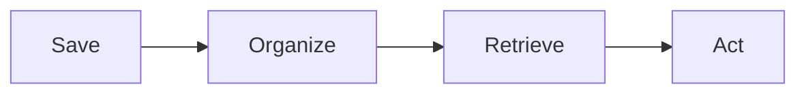
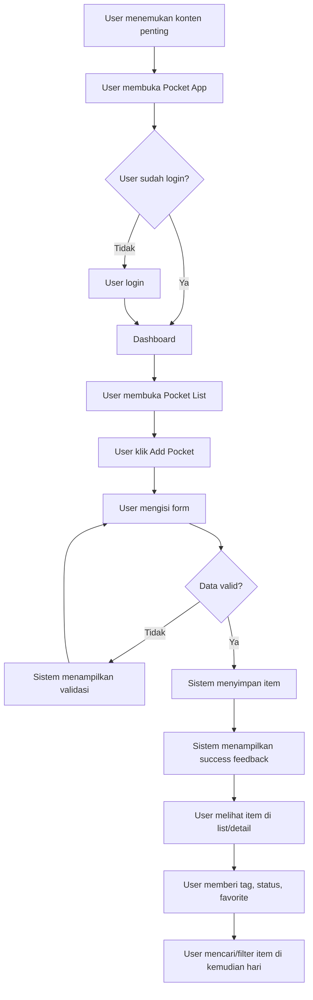
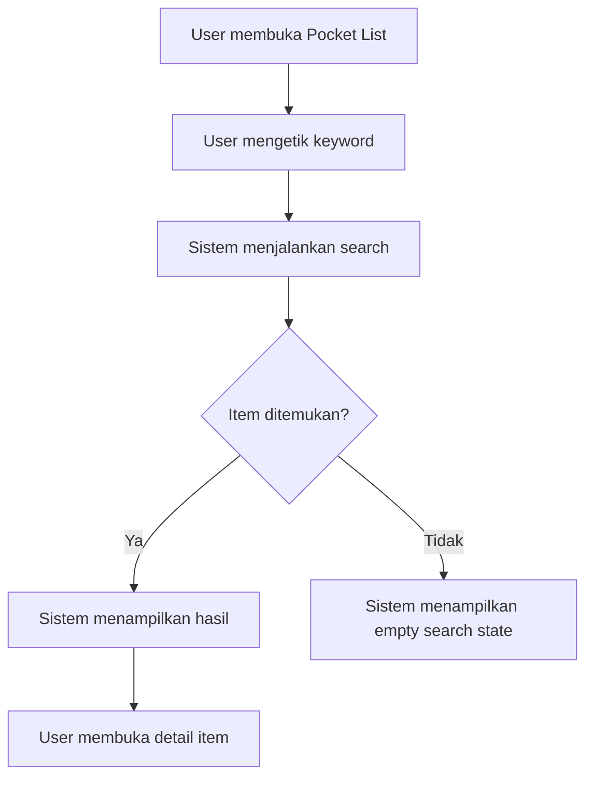
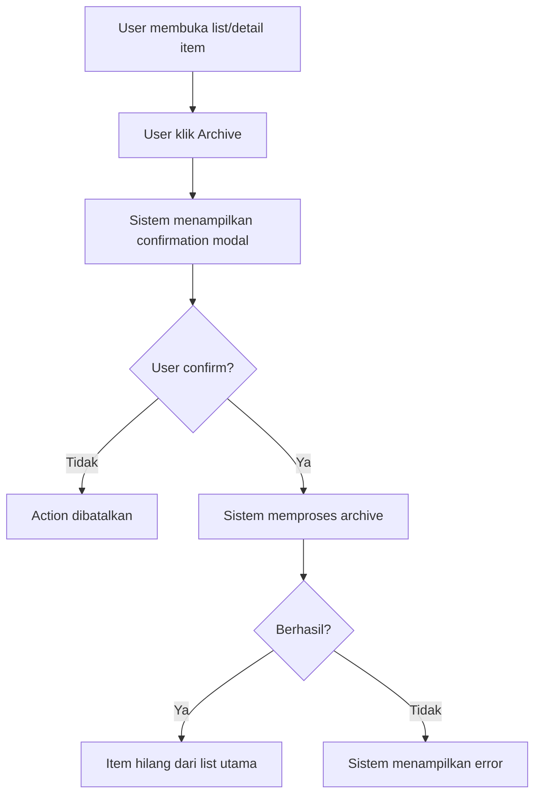
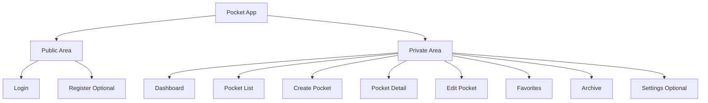
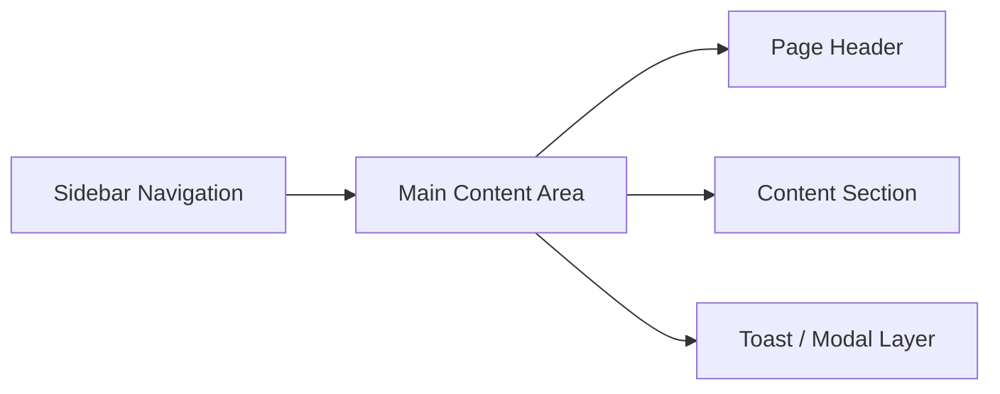
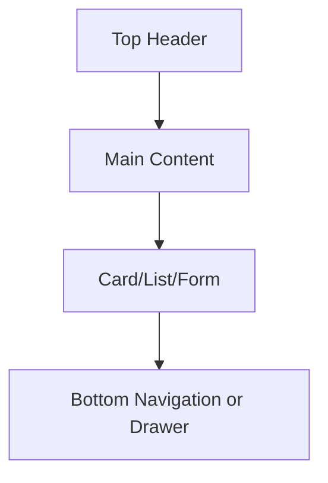

# Product Requirement Document

# Software Aplikasi Pocket

---

## Document Metadata

| Field             | Value                                                     |
| ----------------- | --------------------------------------------------------- |
| Product Name      | Pocket App                                                |
| Project Type      | Software Application                                      |
| Document Type     | Product Requirement Document                              |
| Version           | v1.0                                                      |
| Status            | Draft                                                     |
| Target Platform   | Responsive Web Application                                |
| Primary Objective | Take-home test frontend developer dengan AI workflow      |
| Target Users      | Individual user, knowledge worker, learner, casual reader |
| Main Scope        | Personal pocket item management                           |
| Author            | Product Team                                              |
| Reviewer          | Product Owner, Frontend Lead, Backend Lead, QA            |
| Created Date      | 2026-06-26                                                |
| Last Updated      | 2026-06-26                                                |

---

# 1. Executive Summary

Pocket App adalah aplikasi web personal yang membantu user menyimpan, mengelola, mencari, membaca ulang, dan mengarsipkan item penting seperti artikel, link, video, dokumen referensi, dan catatan pribadi.

Aplikasi ini dirancang sebagai project take-home test untuk frontend developer. PRD ini tidak hanya menjelaskan fitur, tetapi juga mendefinisikan requirement secara lengkap agar kandidat dapat mengubah PRD menjadi technical plan, component breakdown, API integration plan, state management strategy, dan implementasi frontend yang maintainable.

Core flow aplikasi adalah:

> Save → Organize → Retrieve → Act

User dapat menyimpan item baru, memberi tag, menentukan content type, menandai item sebagai favorite, mengubah status baca, mencari item lama, memfilter berdasarkan status/type/favorite, melihat detail item, mengubah item, serta mengarsipkan item.

---

# 2. Product Vision

Pocket App bertujuan menjadi aplikasi personal yang sederhana, cepat, dan terstruktur untuk menyimpan serta menemukan kembali informasi penting.

Product vision:

> Membantu user menyimpan dan menemukan kembali konten penting secara cepat, rapi, dan mudah digunakan melalui aplikasi personal pocket management yang ringan, responsif, dan terstruktur.

---

# 3. Background

User sering menemukan informasi penting dari berbagai sumber, seperti artikel, dokumentasi teknis, video, catatan belajar, referensi kerja, atau ide pribadi. Namun informasi tersebut sering tersebar di banyak tempat seperti browser bookmark, chat pribadi, notes, screenshot, email, atau tab browser yang dibiarkan terbuka.

Kondisi tersebut membuat user sulit menemukan ulang item yang pernah disimpan, tidak tahu mana item yang belum dibaca, tidak memiliki pengelompokan yang rapi, dan sering kehilangan konteks terhadap item yang sebelumnya dianggap penting.

Pocket App dibuat untuk menyelesaikan masalah tersebut dengan menyediakan tempat terpusat untuk menyimpan dan mengelola item penting secara personal.

---

# 4. Problem Statement

User membutuhkan tempat terpusat untuk menyimpan, mengelompokkan, mencari ulang, dan menindaklanjuti informasi penting. Saat ini, item penting tersebar di berbagai aplikasi dan tidak memiliki struktur yang konsisten.

Problem statement utama:

> User sulit menyimpan, mengelompokkan, mencari ulang, dan menindaklanjuti konten penting karena belum tersedia sistem personal pocket yang terpusat, sederhana, dan mudah digunakan.

---

# 5. Problem Analysis

| Area             | Problem                                                    | Impact                                        |
| ---------------- | ---------------------------------------------------------- | --------------------------------------------- |
| Storage          | Item disimpan di banyak tempat berbeda                     | User sulit mengelola informasi penting        |
| Retrieval        | Item lama sulit ditemukan kembali                          | User membuang waktu mencari referensi         |
| Organization     | Tidak ada tagging atau kategori konsisten                  | Item menjadi berantakan                       |
| Reading Status   | User tidak tahu mana yang belum, sedang, atau sudah dibaca | Progress membaca tidak terpantau              |
| Prioritization   | Tidak ada favorite marker                                  | Item penting tertimbun                        |
| UX Feedback      | Tidak ada feedback jelas saat loading/error/empty          | User bingung terhadap kondisi aplikasi        |
| Data Consistency | Perubahan status/favorite/delete tidak sinkron             | User kehilangan kepercayaan terhadap aplikasi |
| Mobile Access    | UI tidak selalu nyaman di layar kecil                      | User sulit mengakses dari perangkat mobile    |

---

# 6. Goals

| ID    | Goal                                              | Success Indicator                                               |
| ----- | ------------------------------------------------- | --------------------------------------------------------------- |
| G-001 | User dapat menyimpan item baru dengan cepat       | User dapat membuat pocket item dalam maksimal 3 langkah utama   |
| G-002 | User dapat melihat daftar item tersimpan          | Pocket list menampilkan semua item aktif dengan informasi utama |
| G-003 | User dapat menemukan kembali item lama            | Search dan filter dapat digunakan                               |
| G-004 | User dapat mengelola status baca                  | User dapat mengubah status unread, reading, read                |
| G-005 | User dapat menandai item penting                  | User dapat toggle favorite                                      |
| G-006 | User dapat mengelompokkan item                    | User dapat menambahkan tag                                      |
| G-007 | UI informatif di semua kondisi                    | Loading, empty, error, success, unauthorized state tersedia     |
| G-008 | Aplikasi nyaman di desktop dan mobile             | Layout responsive tanpa horizontal overflow                     |
| G-009 | Project dapat menilai kemampuan frontend kandidat | Mencakup routing, state, form, validation, API, UI state        |

---

# 7. Non-Goals

| ID     | Non-Goal                         | Reason                                       |
| ------ | -------------------------------- | -------------------------------------------- |
| NG-001 | Native mobile app                | MVP difokuskan pada responsive web app       |
| NG-002 | Browser extension                | Terlalu besar untuk take-home test           |
| NG-003 | AI summary otomatis              | Fitur lanjutan, bukan MVP                    |
| NG-004 | Offline reading                  | Membutuhkan cache/sync tambahan              |
| NG-005 | Team collaboration               | MVP hanya untuk personal user                |
| NG-006 | Public sharing                   | Tidak termasuk core flow MVP                 |
| NG-007 | Payment/subscription             | Tidak relevan dengan take-home frontend test |
| NG-008 | File upload                      | MVP fokus pada URL dan note                  |
| NG-009 | Full text extraction             | MVP cukup metadata manual                    |
| NG-010 | Multi-device conflict resolution | Tidak dibutuhkan untuk simulasi MVP          |

---

# 8. Target User

## 8.1 Primary Persona — Knowledge Worker

| Attribute          | Detail                                                        |
| ------------------ | ------------------------------------------------------------- |
| Role               | Product manager, engineer, designer, researcher, analyst      |
| Main Need          | Menyimpan artikel, dokumentasi, referensi kerja, dan ide      |
| Pain Point         | Informasi tersebar di browser, chat, notes, dan email         |
| Motivation         | Ingin punya tempat rapi untuk menyimpan dan mencari referensi |
| Important Features | Search, tag, favorite, status, detail item                    |

## 8.2 Secondary Persona — Student / Learner

| Attribute          | Detail                                                |
| ------------------ | ----------------------------------------------------- |
| Role               | Mahasiswa, bootcamp student, self-learner             |
| Main Need          | Menyimpan materi belajar, artikel, video, dan catatan |
| Pain Point         | Sulit mengelompokkan materi berdasarkan topik         |
| Motivation         | Ingin melacak materi yang belum dan sudah dipelajari  |
| Important Features | Tag, status read/unread, search, filter by type       |

## 8.3 Secondary Persona — Casual Reader

| Attribute          | Detail                                          |
| ------------------ | ----------------------------------------------- |
| Role               | Pengguna umum                                   |
| Main Need          | Menyimpan artikel atau video untuk dibaca nanti |
| Pain Point         | Link sering hilang di chat atau tab browser     |
| Motivation         | Ingin menyimpan konten menarik dengan cepat     |
| Important Features | Create item, favorite, list, archive            |

---

# 9. Product Concept

Pocket App memiliki empat aktivitas utama.



| Concept  | Description                                                               |
| -------- | ------------------------------------------------------------------------- |
| Save     | User menyimpan link, artikel, video, dokumen, atau catatan                |
| Organize | User memberi tag, type, status, dan favorite                              |
| Retrieve | User mencari dan memfilter item lama                                      |
| Act      | User membuka detail, membuka link, edit, update status, favorite, archive |

---

# 10. Product Scope

## 10.1 In Scope MVP

| ID    | Scope                                     |
| ----- | ----------------------------------------- |
| S-001 | Mock authentication                       |
| S-002 | Protected route                           |
| S-003 | Dashboard summary                         |
| S-004 | Pocket item list                          |
| S-005 | Create pocket item                        |
| S-006 | Pocket item detail                        |
| S-007 | Edit pocket item                          |
| S-008 | Archive/delete pocket item                |
| S-009 | Search pocket item                        |
| S-010 | Filter by status                          |
| S-011 | Filter by content type                    |
| S-012 | Filter favorite item                      |
| S-013 | Sort item                                 |
| S-014 | Toggle favorite                           |
| S-015 | Update reading status                     |
| S-016 | Manual tag input                          |
| S-017 | Empty state                               |
| S-018 | Loading state                             |
| S-019 | Error state                               |
| S-020 | Success feedback                          |
| S-021 | Responsive layout                         |
| S-022 | Basic accessibility support               |
| S-023 | API/mock API integration                  |
| S-024 | Form validation                           |
| S-025 | Confirmation modal for destructive action |

## 10.2 Out of Scope MVP

| ID     | Scope                    |
| ------ | ------------------------ |
| OS-001 | Real OAuth login         |
| OS-002 | Browser extension        |
| OS-003 | Native mobile app        |
| OS-004 | File upload              |
| OS-005 | AI summary               |
| OS-006 | Auto metadata extraction |
| OS-007 | Auto tagging             |
| OS-008 | Team collaboration       |
| OS-009 | Public sharing           |
| OS-010 | Offline mode             |
| OS-011 | Push notification        |
| OS-012 | Email reminder           |
| OS-013 | Bookmark import          |
| OS-014 | Full article reader      |
| OS-015 | Highlight and annotation |
| OS-016 | Admin dashboard          |

---

# 11. User Journey

## 11.1 Main Journey



## 11.2 Search Journey



## 11.3 Archive Journey



---

# 12. Business Rules

| ID     | Rule                                                                   |
| ------ | ---------------------------------------------------------------------- |
| BR-001 | User harus login sebelum mengakses dashboard dan pocket item           |
| BR-002 | User hanya dapat melihat pocket item miliknya sendiri                  |
| BR-003 | Title wajib diisi untuk setiap pocket item                             |
| BR-004 | URL wajib diisi jika content type adalah article, video, atau document |
| BR-005 | URL harus memiliki format valid                                        |
| BR-006 | URL tidak wajib jika content type adalah note                          |
| BR-007 | Description bersifat opsional                                          |
| BR-008 | Tag bersifat opsional                                                  |
| BR-009 | Tag tidak boleh duplicate dalam satu item                              |
| BR-010 | Status default item baru adalah unread                                 |
| BR-011 | Favorite default item baru adalah false                                |
| BR-012 | Archived item tidak tampil di pocket list utama                        |
| BR-013 | Archived item tampil di archive page                                   |
| BR-014 | Delete pada MVP diperlakukan sebagai archive/soft delete               |
| BR-015 | Search dilakukan terhadap title, URL, description, dan tags            |
| BR-016 | Filter dapat dikombinasikan dengan search                              |
| BR-017 | Sort default adalah createdAt descending                               |
| BR-018 | User tidak boleh submit form berkali-kali saat proses submit berjalan  |
| BR-019 | Error API tidak boleh menghapus input yang sudah diisi user            |
| BR-020 | Empty state harus memiliki CTA yang relevan                            |
| BR-021 | Unauthorized user harus diarahkan ke login page                        |
| BR-022 | External link harus dibuka secara aman di tab baru                     |

---

# 13. Feature List

| Feature ID | Feature               | Description                                   | Priority    |
| ---------- | --------------------- | --------------------------------------------- | ----------- |
| F-001      | Mock Authentication   | User dapat login/logout dengan mekanisme mock | Must Have   |
| F-002      | Dashboard Summary     | User melihat ringkasan item                   | Should Have |
| F-003      | Pocket List           | User melihat daftar pocket item               | Must Have   |
| F-004      | Create Pocket Item    | User membuat item baru                        | Must Have   |
| F-005      | Pocket Detail         | User melihat detail item                      | Must Have   |
| F-006      | Edit Pocket Item      | User mengubah data item                       | Must Have   |
| F-007      | Archive/Delete Item   | User mengarsipkan item                        | Must Have   |
| F-008      | Search Item           | User mencari item berdasarkan keyword         | Must Have   |
| F-009      | Filter Item           | User filter berdasarkan status/type/favorite  | Should Have |
| F-010      | Sort Item             | User mengurutkan item                         | Should Have |
| F-011      | Toggle Favorite       | User menandai item sebagai favorite           | Should Have |
| F-012      | Update Reading Status | User mengubah status baca                     | Should Have |
| F-013      | Tagging               | User menambahkan tag manual                   | Should Have |
| F-014      | UI State Handling     | Loading, empty, error, success state          | Must Have   |
| F-015      | Responsive Layout     | Tampilan adaptif desktop/mobile               | Must Have   |
| F-016      | Confirmation Modal    | Konfirmasi sebelum destructive action         | Must Have   |
| F-017      | Toast/Alert Feedback  | Feedback sukses/error                         | Must Have   |
| F-018      | Protected Routing     | Halaman internal hanya untuk user login       | Must Have   |

---

# 14. Functional Requirements

## 14.1 Authentication Requirements

| ID          | Requirement                                                         | Priority  |
| ----------- | ------------------------------------------------------------------- | --------- |
| FR-AUTH-001 | User dapat membuka halaman login                                    | Must Have |
| FR-AUTH-002 | User dapat mengisi email dan password                               | Must Have |
| FR-AUTH-003 | Sistem memvalidasi email wajib diisi                                | Must Have |
| FR-AUTH-004 | Sistem memvalidasi format email                                     | Must Have |
| FR-AUTH-005 | Sistem memvalidasi password wajib diisi                             | Must Have |
| FR-AUTH-006 | User dapat login menggunakan credential mock                        | Must Have |
| FR-AUTH-007 | Sistem menyimpan session/token mock setelah login berhasil          | Must Have |
| FR-AUTH-008 | User diarahkan ke dashboard setelah login berhasil                  | Must Have |
| FR-AUTH-009 | User melihat error jika login gagal                                 | Must Have |
| FR-AUTH-010 | User dapat logout                                                   | Must Have |
| FR-AUTH-011 | User yang belum login diarahkan ke login saat akses protected route | Must Have |

## 14.2 Dashboard Requirements

| ID          | Requirement                                                | Priority    |
| ----------- | ---------------------------------------------------------- | ----------- |
| FR-DASH-001 | User dapat melihat total pocket item                       | Should Have |
| FR-DASH-002 | User dapat melihat total unread item                       | Should Have |
| FR-DASH-003 | User dapat melihat total reading item                      | Should Have |
| FR-DASH-004 | User dapat melihat total read item                         | Should Have |
| FR-DASH-005 | User dapat melihat total favorite item                     | Should Have |
| FR-DASH-006 | User dapat melihat recently added items                    | Should Have |
| FR-DASH-007 | User dapat klik CTA Add Pocket dari dashboard              | Should Have |
| FR-DASH-008 | User dapat melihat dashboard empty state jika data kosong  | Should Have |
| FR-DASH-009 | User dapat melihat error state jika dashboard gagal dimuat | Should Have |

## 14.3 Pocket List Requirements

| ID          | Requirement                                                                                         | Priority    |
| ----------- | --------------------------------------------------------------------------------------------------- | ----------- |
| FR-LIST-001 | User dapat melihat daftar pocket item                                                               | Must Have   |
| FR-LIST-002 | Setiap item menampilkan title, URL/domain, description, type, status, tags, favorite, dan createdAt | Must Have   |
| FR-LIST-003 | User dapat membuka detail item dari list                                                            | Must Have   |
| FR-LIST-004 | User dapat membuka form create item dari list                                                       | Must Have   |
| FR-LIST-005 | User dapat melihat loading state saat data dimuat                                                   | Must Have   |
| FR-LIST-006 | User dapat melihat empty state jika tidak ada item                                                  | Must Have   |
| FR-LIST-007 | User dapat melihat error state jika gagal mengambil data                                            | Must Have   |
| FR-LIST-008 | User dapat retry saat API gagal                                                                     | Should Have |
| FR-LIST-009 | User dapat melihat pagination/load more jika data banyak                                            | Could Have  |

## 14.4 Create Pocket Requirements

| ID            | Requirement                                                    | Priority    |
| ------------- | -------------------------------------------------------------- | ----------- |
| FR-CREATE-001 | User dapat membuka halaman create pocket item                  | Must Have   |
| FR-CREATE-002 | User dapat mengisi title                                       | Must Have   |
| FR-CREATE-003 | User dapat mengisi URL                                         | Must Have   |
| FR-CREATE-004 | User dapat mengisi description                                 | Should Have |
| FR-CREATE-005 | User dapat memilih content type                                | Must Have   |
| FR-CREATE-006 | User dapat menambahkan tags                                    | Should Have |
| FR-CREATE-007 | Sistem memvalidasi title wajib diisi                           | Must Have   |
| FR-CREATE-008 | Sistem memvalidasi URL wajib jika type bukan note              | Must Have   |
| FR-CREATE-009 | Sistem memvalidasi format URL                                  | Must Have   |
| FR-CREATE-010 | Sistem mencegah duplicate tag                                  | Should Have |
| FR-CREATE-011 | Sistem men-disable submit button saat loading                  | Must Have   |
| FR-CREATE-012 | Sistem menampilkan feedback sukses setelah berhasil dibuat     | Must Have   |
| FR-CREATE-013 | Sistem mengarahkan user ke detail/list setelah berhasil dibuat | Must Have   |
| FR-CREATE-014 | Sistem menampilkan error jika gagal membuat item               | Must Have   |
| FR-CREATE-015 | Input user tidak hilang jika submit gagal                      | Must Have   |

## 14.5 Detail Requirements

| ID            | Requirement                                                                                    | Priority    |
| ------------- | ---------------------------------------------------------------------------------------------- | ----------- |
| FR-DETAIL-001 | User dapat membuka detail pocket item                                                          | Must Have   |
| FR-DETAIL-002 | Sistem menampilkan title, URL, description, type, status, favorite, tags, createdAt, updatedAt | Must Have   |
| FR-DETAIL-003 | User dapat membuka URL asli di tab baru                                                        | Should Have |
| FR-DETAIL-004 | User dapat klik edit dari detail page                                                          | Must Have   |
| FR-DETAIL-005 | User dapat toggle favorite dari detail page                                                    | Should Have |
| FR-DETAIL-006 | User dapat mengubah status dari detail page                                                    | Should Have |
| FR-DETAIL-007 | User dapat archive/delete dari detail page                                                     | Must Have   |
| FR-DETAIL-008 | Sistem menampilkan not found state jika item tidak ditemukan                                   | Must Have   |
| FR-DETAIL-009 | Sistem menampilkan loading state saat detail dimuat                                            | Must Have   |
| FR-DETAIL-010 | Sistem menampilkan error state jika API gagal                                                  | Must Have   |

## 14.6 Edit Requirements

| ID          | Requirement                                         | Priority    |
| ----------- | --------------------------------------------------- | ----------- |
| FR-EDIT-001 | User dapat membuka halaman edit item                | Must Have   |
| FR-EDIT-002 | Form edit menampilkan data existing                 | Must Have   |
| FR-EDIT-003 | User dapat mengubah title                           | Must Have   |
| FR-EDIT-004 | User dapat mengubah URL                             | Must Have   |
| FR-EDIT-005 | User dapat mengubah description                     | Should Have |
| FR-EDIT-006 | User dapat mengubah content type                    | Should Have |
| FR-EDIT-007 | User dapat mengubah tags                            | Should Have |
| FR-EDIT-008 | Sistem menjalankan validasi yang sama dengan create | Must Have   |
| FR-EDIT-009 | Sistem menampilkan feedback sukses setelah update   | Must Have   |
| FR-EDIT-010 | Sistem menampilkan error jika update gagal          | Must Have   |
| FR-EDIT-011 | User dapat cancel edit dan kembali ke detail/list   | Should Have |

## 14.7 Archive/Delete Requirements

| ID            | Requirement                                                   | Priority  |
| ------------- | ------------------------------------------------------------- | --------- |
| FR-DELETE-001 | User dapat menekan action archive/delete pada item            | Must Have |
| FR-DELETE-002 | Sistem menampilkan confirmation modal sebelum action          | Must Have |
| FR-DELETE-003 | User dapat membatalkan action                                 | Must Have |
| FR-DELETE-004 | User dapat mengkonfirmasi action                              | Must Have |
| FR-DELETE-005 | Sistem menampilkan loading state saat action diproses         | Must Have |
| FR-DELETE-006 | Item hilang dari list utama setelah berhasil archived/deleted | Must Have |
| FR-DELETE-007 | Sistem menampilkan feedback sukses                            | Must Have |
| FR-DELETE-008 | Sistem menampilkan error jika action gagal                    | Must Have |

## 14.8 Search, Filter, Sort Requirements

| ID         | Requirement                                                      | Priority    |
| ---------- | ---------------------------------------------------------------- | ----------- |
| FR-SFS-001 | User dapat mencari item berdasarkan keyword                      | Must Have   |
| FR-SFS-002 | Search mencakup title, URL, description, dan tags                | Must Have   |
| FR-SFS-003 | User dapat filter berdasarkan status                             | Should Have |
| FR-SFS-004 | User dapat filter berdasarkan content type                       | Should Have |
| FR-SFS-005 | User dapat filter favorite item                                  | Should Have |
| FR-SFS-006 | User dapat menghapus filter                                      | Should Have |
| FR-SFS-007 | User dapat sort newest/oldest/title                              | Should Have |
| FR-SFS-008 | Sistem menampilkan empty search state jika hasil tidak ditemukan | Must Have   |
| FR-SFS-009 | Search dan filter dapat digunakan bersamaan                      | Should Have |
| FR-SFS-010 | Search keyword idealnya tercermin di URL query params            | Could Have  |

---

# 15. Non-Functional Requirements

| ID      | Category         | Requirement                                                   |
| ------- | ---------------- | ------------------------------------------------------------- |
| NFR-001 | Performance      | First meaningful content maksimal 3 detik pada koneksi normal |
| NFR-002 | Performance      | Search/filter responsif untuk minimal 100 item mock data      |
| NFR-003 | Performance      | UI tidak freeze saat list dirender                            |
| NFR-004 | Usability        | User dapat membuat item baru dalam maksimal 3 langkah utama   |
| NFR-005 | Usability        | Error message harus jelas dan actionable                      |
| NFR-006 | Accessibility    | Semua input harus memiliki label                              |
| NFR-007 | Accessibility    | Semua interactive element dapat diakses keyboard              |
| NFR-008 | Accessibility    | Button/action harus memiliki focus state                      |
| NFR-009 | Responsiveness   | Layout mendukung desktop minimal 1024px                       |
| NFR-010 | Responsiveness   | Layout mendukung mobile minimal 375px                         |
| NFR-011 | Reliability      | API error harus ditangani dengan error state                  |
| NFR-012 | Reliability      | Form input tidak boleh hilang ketika submit gagal             |
| NFR-013 | Security         | Protected route tidak boleh diakses tanpa session             |
| NFR-014 | Security         | User input tidak boleh dirender sebagai raw HTML              |
| NFR-015 | Maintainability  | Komponen reusable dipisahkan dari business logic              |
| NFR-016 | Maintainability  | API service layer dipisahkan dari UI component                |
| NFR-017 | Maintainability  | Form validation memiliki pola konsisten                       |
| NFR-018 | Data Consistency | Setelah mutation, UI harus merefleksikan state terbaru        |
| NFR-019 | Error Handling   | Error global dan field-level error harus dibedakan            |
| NFR-020 | Browser Support  | Aplikasi berjalan di latest Chrome, Firefox, Safari, Edge     |

---

# 16. Information Architecture



---

# 17. Screen Mapping

| Screen ID | Screen Name   | Route                         | Description                    | Priority    |
| --------- | ------------- | ----------------------------- | ------------------------------ | ----------- |
| SCR-001   | Login         | `/login`                      | Halaman login user             | Must Have   |
| SCR-002   | Dashboard     | `/dashboard`                  | Ringkasan pocket user          | Should Have |
| SCR-003   | Pocket List   | `/pockets`                    | Daftar semua pocket item aktif | Must Have   |
| SCR-004   | Create Pocket | `/pockets/create`             | Form membuat pocket item       | Must Have   |
| SCR-005   | Pocket Detail | `/pockets/:id`                | Detail pocket item             | Must Have   |
| SCR-006   | Edit Pocket   | `/pockets/:id/edit`           | Form edit pocket item          | Must Have   |
| SCR-007   | Favorites     | `/favorites`                  | Daftar item favorite           | Should Have |
| SCR-008   | Archive       | `/archive`                    | Daftar item archived           | Should Have |
| SCR-009   | Not Found     | `*`                           | Halaman route tidak ditemukan  | Must Have   |
| SCR-010   | Unauthorized  | `/unauthorized` atau redirect | Halaman akses tidak valid      | Could Have  |

---

# 18. Route Structure

| Route               | Screen        | Auth Required | Behavior                                                    |
| ------------------- | ------------- | ------------: | ----------------------------------------------------------- |
| `/`                 | Root          |            No | Redirect ke `/dashboard` jika login, ke `/login` jika belum |
| `/login`            | Login         |            No | Redirect ke dashboard jika sudah login                      |
| `/dashboard`        | Dashboard     |           Yes | Menampilkan summary                                         |
| `/pockets`          | Pocket List   |           Yes | Menampilkan list item                                       |
| `/pockets/create`   | Create Pocket |           Yes | Menampilkan form create                                     |
| `/pockets/:id`      | Pocket Detail |           Yes | Menampilkan detail item                                     |
| `/pockets/:id/edit` | Edit Pocket   |           Yes | Menampilkan form edit                                       |
| `/favorites`        | Favorites     |           Yes | Menampilkan favorite items                                  |
| `/archive`          | Archive       |           Yes | Menampilkan archived items                                  |
| `*`                 | Not Found     |            No | Menampilkan 404 page                                        |

---

# 19. UI Specification

## 19.1 Design Principles

| Principle         | Description                                                                   |
| ----------------- | ----------------------------------------------------------------------------- |
| Simple First      | UI tidak boleh terlalu ramai dan harus fokus pada item user                   |
| Fast Action       | Add Pocket, Search, Favorite, dan Change Status mudah diakses                 |
| Clear Feedback    | Setiap aksi memiliki feedback loading, success, error, disabled, confirmation |
| Consistent Layout | Struktur halaman, spacing, button, card, form konsisten                       |
| Responsive        | UI nyaman di desktop dan mobile                                               |
| Accessible        | Form, button, modal, dan navigasi dapat digunakan keyboard                    |

---

## 19.2 Desktop Layout



| Area         | Description                            |
| ------------ | -------------------------------------- |
| Sidebar      | Dashboard, Pockets, Favorites, Archive |
| Header       | Page title, page action, user menu     |
| Main Content | List, detail, form, dashboard          |
| Toast Area   | Feedback success/error                 |
| Modal Layer  | Confirmation modal                     |

---

## 19.3 Mobile Layout



| Area         | Description                             |
| ------------ | --------------------------------------- |
| Top Header   | Title halaman dan action utama          |
| Main Content | Konten full width                       |
| Navigation   | Bottom navigation atau drawer           |
| CTA          | Add Pocket dapat dibuat sticky/floating |
| Modal        | Full-width modal atau bottom sheet      |

---

## 19.4 App Shell Requirement

| Element        | Requirement                                            |
| -------------- | ------------------------------------------------------ |
| Sidebar/Menu   | Menampilkan Dashboard, Pockets, Favorites, Archive     |
| Active Menu    | Menu aktif memiliki visual state berbeda               |
| User Menu      | Menampilkan nama/avatar user dan logout                |
| Main Area      | Memiliki padding dan max width nyaman                  |
| Toast          | Muncul setelah action sukses/gagal                     |
| Loading Global | Loading screen sederhana saat app/session initializing |

---

## 19.5 Design Token Recommendation

### Color Tokens

| Token                 | Usage                           |
| --------------------- | ------------------------------- |
| `color.background`    | Background utama aplikasi       |
| `color.surface`       | Card, modal, form container     |
| `color.surfaceMuted`  | Empty state atau secondary area |
| `color.textPrimary`   | Teks utama                      |
| `color.textSecondary` | Teks pendukung                  |
| `color.textMuted`     | Metadata, hint, placeholder     |
| `color.border`        | Border card/input               |
| `color.primary`       | CTA utama                       |
| `color.primaryHover`  | Hover CTA utama                 |
| `color.danger`        | Destructive action              |
| `color.warning`       | Warning state                   |
| `color.success`       | Success state                   |
| `color.error`         | Error state                     |
| `color.info`          | Informational state             |

### Spacing Tokens

| Token       | Recommended Value | Usage                  |
| ----------- | ----------------: | ---------------------- |
| `space.xs`  |               4px | Icon spacing           |
| `space.sm`  |               8px | Helper text, chip gap  |
| `space.md`  |              16px | Card padding, form gap |
| `space.lg`  |              24px | Section spacing        |
| `space.xl`  |              32px | Page block spacing     |
| `space.2xl` |              48px | Empty state spacing    |

### Radius Tokens

| Token       | Recommended Value | Usage                 |
| ----------- | ----------------: | --------------------- |
| `radius.sm` |               6px | Badge/chip            |
| `radius.md` |               8px | Input/button          |
| `radius.lg` |              12px | Card                  |
| `radius.xl` |              16px | Modal/container besar |

### Typography Tokens

| Token             | Usage                |
| ----------------- | -------------------- |
| `text.display`    | Judul halaman besar  |
| `text.heading`    | Section title        |
| `text.subheading` | Card title           |
| `text.body`       | Body text            |
| `text.caption`    | Metadata/helper text |
| `text.error`      | Field error          |

---

# 20. Component Specification

## 20.1 Button

| Variant     | Usage                              | Requirement                  |
| ----------- | ---------------------------------- | ---------------------------- |
| Primary     | Save, Add Pocket, Login            | CTA utama                    |
| Secondary   | Cancel, Back                       | Action alternatif            |
| Ghost       | Reset filter, light action         | Visual minimal               |
| Danger      | Archive/Delete                     | Terlihat destructive         |
| Icon Button | Favorite, close modal, action menu | Wajib punya accessible label |

| State    | Requirement                       |
| -------- | --------------------------------- |
| Default  | Dapat diklik                      |
| Hover    | Ada visual feedback               |
| Focus    | Ada focus ring                    |
| Disabled | Tidak dapat diklik                |
| Loading  | Spinner/text loading dan disabled |
| Active   | Untuk toggle/filter button        |

---

## 20.2 Input

| Input Type      | Usage                      |
| --------------- | -------------------------- |
| Text Input      | Title, search, tag         |
| URL Input       | URL pocket item            |
| Password Input  | Login password             |
| Textarea        | Description                |
| Select          | Content type, status, sort |
| Checkbox/Toggle | Favorite filter            |

| State       | Requirement                           |
| ----------- | ------------------------------------- |
| Default     | Label dan placeholder jelas           |
| Focus       | Border/focus ring terlihat            |
| Error       | Border error dan error message tampil |
| Disabled    | Tidak dapat diedit                    |
| Helper Text | Dapat digunakan untuk hint            |
| Required    | Field wajib diberi indikator          |

---

## 20.3 Pocket Item Card

| Element            | Requirement                     |
| ------------------ | ------------------------------- |
| Title              | Wajib tampil, maksimal 2 baris  |
| URL/Domain         | Tampil jika tersedia            |
| Description        | Opsional, maksimal 2–3 baris    |
| Content Type Badge | Article/Video/Document/Note     |
| Status Badge       | Unread/Reading/Read/Archived    |
| Tags               | Maksimal 3 tag lalu `+n`        |
| Favorite Button    | Icon favorite aktif/tidak aktif |
| Created Date       | Metadata tanggal dibuat         |
| Action Menu        | Edit, Archive, Change Status    |
| Click Area         | Klik card membuka detail        |

| State    | Requirement                              |
| -------- | ---------------------------------------- |
| Default  | Informasi utama terbaca                  |
| Hover    | Ada visual feedback                      |
| Focus    | Card/action dapat difokuskan             |
| Loading  | Skeleton card                            |
| Updating | Action terkait disabled/loading          |
| Archived | Visual muted jika tampil di archive page |

---

## 20.4 Badge / Chip

| Type               | Usage                        |
| ------------------ | ---------------------------- |
| Content Type Badge | Article/video/document/note  |
| Status Badge       | Unread/reading/read/archived |
| Tag Chip           | Tag user                     |
| Count Badge        | Jumlah item dashboard/filter |

| Area        | Requirement                       |
| ----------- | --------------------------------- |
| Readability | Label singkat dan mudah dibaca    |
| Consistency | Style konsisten di list/detail    |
| Overflow    | Tag terlalu banyak diringkas      |
| Remove Tag  | Pada form, tag chip dapat dihapus |

---

## 20.5 Modal Confirmation

| Element        | Requirement                        |
| -------------- | ---------------------------------- |
| Title          | Menjelaskan action                 |
| Description    | Menjelaskan konsekuensi            |
| Cancel Button  | Membatalkan action                 |
| Confirm Button | Melanjutkan action                 |
| Close Button   | Optional                           |
| Loading State  | Confirm button loading saat proses |

| Behavior      | Requirement                                |
| ------------- | ------------------------------------------ |
| Open          | Modal muncul di atas overlay               |
| Focus         | Focus masuk ke modal                       |
| Escape        | Dapat menutup modal jika tidak loading     |
| Outside Click | Optional                                   |
| Loading       | Modal tidak tertutup sampai proses selesai |
| Success       | Modal tertutup dan toast success tampil    |
| Error         | Error feedback tampil jelas                |

---

## 20.6 Toast / Alert

| Type    | Usage                                          |
| ------- | ---------------------------------------------- |
| Success | Create/update/archive/favorite/status berhasil |
| Error   | API gagal atau action gagal                    |
| Warning | Action perlu perhatian                         |
| Info    | Informasi umum                                 |

| Area          | Requirement                            |
| ------------- | -------------------------------------- |
| Duration      | Hilang otomatis setelah beberapa detik |
| Manual Close  | User dapat menutup                     |
| Message       | Singkat dan jelas                      |
| Position      | Konsisten                              |
| Accessibility | Dapat dibaca screen reader dasar       |

---

## 20.7 Empty State

| Area               | Message                                | CTA             |
| ------------------ | -------------------------------------- | --------------- |
| Pocket List kosong | `You have no pocket items yet.`        | `Add Pocket`    |
| Search kosong      | `No items match your search.`          | `Clear Search`  |
| Filter kosong      | `No items match the selected filters.` | `Reset Filter`  |
| Favorites kosong   | `No favorite items yet.`               | `Go to Pockets` |
| Archive kosong     | `No archived items.`                   | `Go to Pockets` |

---

## 20.8 Error State

| Area                  | Message                           | Action              |
| --------------------- | --------------------------------- | ------------------- |
| Pocket List API gagal | `Failed to load pocket items.`    | Retry               |
| Detail API gagal      | `Failed to load pocket item.`     | Retry               |
| Create gagal          | `Failed to create pocket item.`   | Try Again           |
| Update gagal          | `Failed to update pocket item.`   | Try Again           |
| Archive gagal         | `Failed to archive pocket item.`  | Try Again           |
| Auth gagal            | `Email or password is incorrect.` | Re-enter credential |

---

# 21. Screen-Level UI Specification

## 21.1 Login Screen

| Item    | Requirement                            |
| ------- | -------------------------------------- |
| Route   | `/login`                               |
| Purpose | User login menggunakan mock credential |
| Layout  | Form berada di tengah halaman          |
| Title   | `Login to Pocket`                      |
| Fields  | Email, Password                        |
| CTA     | Login                                  |
| Error   | Alert jika credential salah            |
| Success | Redirect ke `/dashboard`               |

| Field    | Type     | Required | Placeholder           |
| -------- | -------- | -------: | --------------------- |
| Email    | email    |      Yes | `user@example.com`    |
| Password | password |      Yes | `Enter your password` |

| State            | Expected UI            |
| ---------------- | ---------------------- |
| Initial          | Form kosong            |
| Validation Error | Error per field tampil |
| Submitting       | Login button loading   |
| Login Failed     | Alert error tampil     |
| Success          | Redirect dashboard     |

---

## 21.2 Dashboard Screen

| Item           | Requirement                            |
| -------------- | -------------------------------------- |
| Route          | `/dashboard`                           |
| Purpose        | Menampilkan ringkasan pocket user      |
| Header         | Title `Dashboard`                      |
| Summary Cards  | Total, Unread, Reading, Read, Favorite |
| CTA            | Add Pocket                             |
| Recently Added | 3–5 item terbaru                       |

| State   | Expected UI                       |
| ------- | --------------------------------- |
| Loading | Skeleton summary cards            |
| Empty   | Count 0 dan CTA                   |
| Error   | Error state + Retry               |
| Success | Summary dan recently added tampil |

---

## 21.3 Pocket List Screen

| Item    | Requirement                             |
| ------- | --------------------------------------- |
| Route   | `/pockets`                              |
| Purpose | Menampilkan semua pocket item aktif     |
| Header  | Title `My Pockets`, CTA `Add Pocket`    |
| Search  | Search by title, URL, description, tags |
| Filter  | Status, content type, favorite          |
| Sort    | Newest, Oldest, Title A-Z, Title Z-A    |
| List    | Card/list pocket item                   |

| Filter       | Options                                                |
| ------------ | ------------------------------------------------------ |
| Status       | All, Unread, Reading, Read                             |
| Content Type | All, Article, Video, Document, Note                    |
| Favorite     | All, Favorite Only                                     |
| Sort         | Newest, Oldest, Title A-Z, Title Z-A, Recently Updated |

| Action           | Behavior                |
| ---------------- | ----------------------- |
| Click card/title | Buka detail             |
| Favorite icon    | Toggle favorite         |
| Status dropdown  | Update status           |
| Edit             | Buka edit page          |
| Archive          | Buka confirmation modal |
| Open Link        | Buka URL di tab baru    |

---

## 21.4 Create Pocket Screen

| Item        | Requirement                  |
| ----------- | ---------------------------- |
| Route       | `/pockets/create`            |
| Purpose     | Membuat pocket item baru     |
| Header      | Title `Add Pocket`           |
| Form Action | Save dan Cancel              |
| Feedback    | Field error dan global error |

| Field        | Type      |    Required | Notes                                  |
| ------------ | --------- | ----------: | -------------------------------------- |
| Title        | Text      |         Yes | 3–120 karakter                         |
| URL          | URL       | Conditional | Wajib jika type article/video/document |
| Content Type | Select    |         Yes | Article, Video, Document, Note         |
| Description  | Textarea  |          No | Max 500 karakter                       |
| Tags         | Tag input |          No | Max 10 tags                            |

---

## 21.5 Pocket Detail Screen

| Item        | Requirement                                       |
| ----------- | ------------------------------------------------- |
| Route       | `/pockets/:id`                                    |
| Purpose     | Menampilkan detail pocket item                    |
| Header      | Back button, title, action menu                   |
| Metadata    | Type, status, favorite, createdAt, updatedAt      |
| URL Section | External link jika ada                            |
| Description | Catatan/deskripsi                                 |
| Tags        | Tag chips                                         |
| Actions     | Edit, Archive, Open Link, Favorite, Change Status |

---

## 21.6 Edit Pocket Screen

| Item         | Requirement          |
| ------------ | -------------------- |
| Route        | `/pockets/:id/edit`  |
| Purpose      | Mengubah pocket item |
| Initial Data | Form prefilled       |
| Loading      | Skeleton form        |
| Submit       | Save Changes         |
| Cancel       | Kembali ke detail    |
| Validation   | Sama dengan create   |

---

## 21.7 Favorites Screen

| Item    | Requirement                     |
| ------- | ------------------------------- |
| Route   | `/favorites`                    |
| Purpose | Menampilkan item favorite       |
| Data    | Item dengan `isFavorite = true` |
| Layout  | Sama dengan pocket list         |
| Empty   | Empty favorite state            |
| Action  | User dapat unfavorite item      |

---

## 21.8 Archive Screen

| Item    | Requirement                      |
| ------- | -------------------------------- |
| Route   | `/archive`                       |
| Purpose | Menampilkan archived item        |
| Data    | Item dengan `status = archived`  |
| Layout  | Sama dengan pocket list          |
| Empty   | Empty archive state              |
| Action  | Optional restore item            |
| Visual  | Item archived dapat tampil muted |

---

# 22. Responsive Specification

| Breakpoint       | Requirement                           |
| ---------------- | ------------------------------------- |
| `>= 1024px`      | Sidebar tampil permanen               |
| `>= 1024px`      | Content memiliki padding besar        |
| `>= 1024px`      | Filter bar horizontal                 |
| `768px - 1023px` | Sidebar boleh collapsible             |
| `768px - 1023px` | Filter dapat wrap                     |
| `<= 767px`       | Sidebar menjadi drawer/bottom nav     |
| `<= 767px`       | Content full width                    |
| `<= 767px`       | Filter collapsible                    |
| `<= 767px`       | Card action masuk kebab menu          |
| `<= 767px`       | Form field stack vertikal             |
| `<= 767px`       | Modal menjadi full-width/bottom sheet |
| `<= 767px`       | Tidak boleh horizontal overflow       |

---

# 23. UI Acceptance Criteria

| ID        | Criteria                                                  |
| --------- | --------------------------------------------------------- |
| UI-AC-001 | Semua halaman utama memiliki title yang jelas             |
| UI-AC-002 | Semua action utama memiliki loading state                 |
| UI-AC-003 | Semua form memiliki field validation                      |
| UI-AC-004 | Semua API failure memiliki error state                    |
| UI-AC-005 | Semua list kosong memiliki empty state                    |
| UI-AC-006 | Semua destructive action memiliki confirmation modal      |
| UI-AC-007 | Pocket item card menampilkan informasi minimum            |
| UI-AC-008 | Search/filter tidak merusak layout                        |
| UI-AC-009 | Layout tidak overflow pada mobile 375px                   |
| UI-AC-010 | Semua icon-only action memiliki accessible label          |
| UI-AC-011 | Button disabled saat proses submit/action berjalan        |
| UI-AC-012 | Toast/alert tampil setelah action berhasil/gagal          |
| UI-AC-013 | User dapat memahami status item dari badge                |
| UI-AC-014 | User dapat kembali dari detail/edit ke halaman sebelumnya |
| UI-AC-015 | UI konsisten antara list, favorites, dan archive          |

---

# 24. Data Model

## 24.1 Pocket Item Entity

```ts
type PocketItem = {
  id: string;
  title: string;
  url?: string;
  description?: string;
  contentType: "article" | "video" | "document" | "note";
  status: "unread" | "reading" | "read" | "archived";
  isFavorite: boolean;
  tags: string[];
  createdAt: string;
  updatedAt: string;
};
```

## 24.2 User Entity

```ts
type User = {
  id: string;
  name: string;
  email: string;
  avatarUrl?: string;
};
```

## 24.3 Dashboard Summary Entity

```ts
type DashboardSummary = {
  totalItems: number;
  unreadItems: number;
  readingItems: number;
  readItems: number;
  archivedItems: number;
  favoriteItems: number;
};
```

## 24.4 API Response Wrapper

```ts
type ApiResponse<T> = {
  data: T;
  message?: string;
};
```

## 24.5 Paginated Response

```ts
type PaginatedResponse<T> = {
  data: T[];
  meta: {
    page: number;
    limit: number;
    total: number;
    totalPage: number;
  };
};
```

## 24.6 API Error Response

```ts
type ApiErrorResponse = {
  code: string;
  message: string;
  details?: {
    field?: string;
    message: string;
  }[];
};
```

---

# 25. Field Definition

| Field       | Type     |    Required | Default        | Description            |
| ----------- | -------- | ----------: | -------------- | ---------------------- |
| id          | string   |         Yes | Auto generated | Unique identifier      |
| title       | string   |         Yes | -              | Judul pocket item      |
| url         | string   | Conditional | -              | URL item               |
| description | string   |          No | Empty string   | Deskripsi/catatan user |
| contentType | enum     |         Yes | article        | Jenis konten           |
| status      | enum     |         Yes | unread         | Status baca            |
| isFavorite  | boolean  |         Yes | false          | Favorite marker        |
| tags        | string[] |          No | []             | Daftar tag             |
| createdAt   | datetime |         Yes | Now            | Tanggal dibuat         |
| updatedAt   | datetime |         Yes | Now            | Tanggal diubah         |

---

# 26. Enum Definition

## 26.1 Content Type

| Value    | Label    | Description                          |
| -------- | -------- | ------------------------------------ |
| article  | Article  | Artikel atau blog                    |
| video    | Video    | Video dari platform eksternal        |
| document | Document | Dokumentasi, PDF link, reference doc |
| note     | Note     | Catatan manual tanpa URL wajib       |

## 26.2 Status

| Value    | Label    | Description               |
| -------- | -------- | ------------------------- |
| unread   | Unread   | Item belum dibaca         |
| reading  | Reading  | Item sedang dibaca        |
| read     | Read     | Item sudah selesai dibaca |
| archived | Archived | Item diarsipkan           |

## 26.3 Sort Option

| Value          | Label            |
| -------------- | ---------------- |
| createdAt:desc | Newest           |
| createdAt:asc  | Oldest           |
| title:asc      | Title A-Z        |
| title:desc     | Title Z-A        |
| updatedAt:desc | Recently Updated |

---

# 27. Validation Rules

## 27.1 Login Form

| Field    | Rule                 | Error Message                          |
| -------- | -------------------- | -------------------------------------- |
| email    | Required             | Email is required                      |
| email    | Valid email format   | Email format is invalid                |
| password | Required             | Password is required                   |
| password | Minimum 6 characters | Password must be at least 6 characters |

## 27.2 Create/Edit Pocket Form

| Field       | Rule                                | Error Message                              |
| ----------- | ----------------------------------- | ------------------------------------------ |
| title       | Required                            | Title is required                          |
| title       | Minimum 3 characters                | Title must be at least 3 characters        |
| title       | Maximum 120 characters              | Title must not exceed 120 characters       |
| url         | Required for article/video/document | URL is required                            |
| url         | Valid URL format                    | URL is invalid                             |
| description | Maximum 500 characters              | Description must not exceed 500 characters |
| contentType | Required                            | Content type is required                   |
| contentType | Must be valid enum                  | Content type is invalid                    |
| tags        | Maximum 10 tags                     | Maximum 10 tags allowed                    |
| tag item    | Maximum 24 characters               | Tag must not exceed 24 characters          |
| tag item    | No duplicate                        | Duplicate tag is not allowed               |

---

# 28. API Contract

## 28.1 Login API

```http
POST /api/auth/login
```

Request:

```json
{
  "email": "user@example.com",
  "password": "password123"
}
```

Success Response:

```json
{
  "data": {
    "token": "mock-token",
    "user": {
      "id": "user_001",
      "name": "John Doe",
      "email": "user@example.com",
      "avatarUrl": "https://example.com/avatar.png"
    }
  },
  "message": "Login success"
}
```

Error Response:

```json
{
  "code": "INVALID_CREDENTIAL",
  "message": "Email or password is incorrect"
}
```

---

## 28.2 Pocket List API

```http
GET /api/pockets?search=react&status=unread&type=article&favorite=true&page=1&limit=10&sort=createdAt:desc
```

Query Parameters:

| Param    | Type    | Required | Description                     |
| -------- | ------- | -------: | ------------------------------- |
| search   | string  |       No | Keyword search                  |
| status   | string  |       No | unread, reading, read, archived |
| type     | string  |       No | article, video, document, note  |
| favorite | boolean |       No | true/false                      |
| page     | number  |       No | Page number                     |
| limit    | number  |       No | Item per page                   |
| sort     | string  |       No | Sort option                     |

Success Response:

```json
{
  "data": [
    {
      "id": "pocket_001",
      "title": "React Performance Guide",
      "url": "https://example.com/react-performance",
      "description": "A guide about React rendering optimization",
      "contentType": "article",
      "status": "unread",
      "isFavorite": true,
      "tags": ["frontend", "react"],
      "createdAt": "2026-06-26T10:00:00Z",
      "updatedAt": "2026-06-26T10:00:00Z"
    }
  ],
  "meta": {
    "page": 1,
    "limit": 10,
    "total": 25,
    "totalPage": 3
  }
}
```

---

## 28.3 Pocket Detail API

```http
GET /api/pockets/:id
```

Success Response:

```json
{
  "data": {
    "id": "pocket_001",
    "title": "React Performance Guide",
    "url": "https://example.com/react-performance",
    "description": "A guide about React rendering optimization",
    "contentType": "article",
    "status": "unread",
    "isFavorite": true,
    "tags": ["frontend", "react"],
    "createdAt": "2026-06-26T10:00:00Z",
    "updatedAt": "2026-06-26T10:00:00Z"
  }
}
```

Not Found Response:

```json
{
  "code": "POCKET_NOT_FOUND",
  "message": "Pocket item not found"
}
```

---

## 28.4 Create Pocket API

```http
POST /api/pockets
```

Request:

```json
{
  "title": "React Performance Guide",
  "url": "https://example.com/react-performance",
  "description": "A guide about React rendering optimization",
  "contentType": "article",
  "tags": ["frontend", "react"]
}
```

Success Response:

```json
{
  "data": {
    "id": "pocket_001",
    "title": "React Performance Guide",
    "url": "https://example.com/react-performance",
    "description": "A guide about React rendering optimization",
    "contentType": "article",
    "status": "unread",
    "isFavorite": false,
    "tags": ["frontend", "react"],
    "createdAt": "2026-06-26T10:00:00Z",
    "updatedAt": "2026-06-26T10:00:00Z"
  },
  "message": "Pocket item created successfully"
}
```

Validation Error Response:

```json
{
  "code": "VALIDATION_ERROR",
  "message": "Validation error",
  "details": [
    {
      "field": "title",
      "message": "Title is required"
    },
    {
      "field": "url",
      "message": "URL is invalid"
    }
  ]
}
```

---

## 28.5 Update Pocket API

```http
PUT /api/pockets/:id
```

Request:

```json
{
  "title": "Updated React Performance Guide",
  "url": "https://example.com/react-performance-updated",
  "description": "Updated description",
  "contentType": "article",
  "tags": ["frontend", "react", "performance"]
}
```

Success Response:

```json
{
  "data": {
    "id": "pocket_001",
    "title": "Updated React Performance Guide",
    "url": "https://example.com/react-performance-updated",
    "description": "Updated description",
    "contentType": "article",
    "status": "unread",
    "isFavorite": false,
    "tags": ["frontend", "react", "performance"],
    "createdAt": "2026-06-26T10:00:00Z",
    "updatedAt": "2026-06-26T11:00:00Z"
  },
  "message": "Pocket item updated successfully"
}
```

---

## 28.6 Archive Pocket API

```http
DELETE /api/pockets/:id
```

Success Response:

```json
{
  "data": {
    "id": "pocket_001"
  },
  "message": "Pocket item archived successfully"
}
```

---

## 28.7 Update Status API

```http
PATCH /api/pockets/:id/status
```

Request:

```json
{
  "status": "read"
}
```

Success Response:

```json
{
  "data": {
    "id": "pocket_001",
    "status": "read",
    "updatedAt": "2026-06-26T11:00:00Z"
  },
  "message": "Status updated successfully"
}
```

---

## 28.8 Toggle Favorite API

```http
PATCH /api/pockets/:id/favorite
```

Request:

```json
{
  "isFavorite": true
}
```

Success Response:

```json
{
  "data": {
    "id": "pocket_001",
    "isFavorite": true,
    "updatedAt": "2026-06-26T11:00:00Z"
  },
  "message": "Favorite updated successfully"
}
```

---

# 29. UI State Requirement

## 29.1 Global State

| State            | Expected UI                              |
| ---------------- | ---------------------------------------- |
| App initializing | Loading screen singkat                   |
| Authenticated    | User dapat masuk private route           |
| Unauthenticated  | User diarahkan ke login                  |
| Route not found  | 404 page                                 |
| Unauthorized     | Redirect login atau unauthorized message |
| Network error    | Pesan umum dan retry jika memungkinkan   |

## 29.2 Pocket List State

| State               | Expected UI                                    |
| ------------------- | ---------------------------------------------- |
| Loading             | Skeleton list/card                             |
| Success with data   | Pocket item list tampil                        |
| Empty default       | Empty state dengan CTA Add Pocket              |
| Empty search result | Pesan `No pocket items found for this search`  |
| Error               | Error message + retry button                   |
| Filtering           | List update sesuai filter                      |
| Deleting item       | Item action disabled/loading                   |
| Favorite updating   | Favorite button loading atau optimistic update |
| Status updating     | Status dropdown/action disabled sementara      |

## 29.3 Create/Edit Form State

| State                  | Expected UI                                             |
| ---------------------- | ------------------------------------------------------- |
| Initial                | Form kosong/default                                     |
| Edit loading           | Skeleton/form loading                                   |
| Typing                 | Field value berubah                                     |
| Field validation error | Error tampil di bawah field                             |
| Submitting             | Submit button disabled dan loading                      |
| Submit success         | Toast success dan redirect                              |
| Submit failed          | Error tampil, input tidak hilang                        |
| Cancel                 | User kembali ke list/detail                             |
| Dirty form optional    | Konfirmasi jika user meninggalkan form dengan perubahan |

## 29.4 Detail State

| State                    | Expected UI               |
| ------------------------ | ------------------------- |
| Loading                  | Skeleton detail           |
| Success                  | Detail item tampil        |
| Not found                | Not found message         |
| Error                    | Error message + retry     |
| Updating status/favorite | Action loading/disabled   |
| Archive confirmation     | Modal confirmation tampil |

---

# 30. User Stories

| ID     | Role                | User Story                                         | Benefit                                               | Priority    |
| ------ | ------------------- | -------------------------------------------------- | ----------------------------------------------------- | ----------- |
| US-001 | Sebagai user        | Saya ingin login ke aplikasi                       | Agar saya dapat mengakses pocket pribadi saya         | Must Have   |
| US-002 | Sebagai user        | Saya ingin melihat dashboard                       | Agar saya memahami ringkasan item saya                | Should Have |
| US-003 | Sebagai user        | Saya ingin melihat daftar pocket item              | Agar saya dapat membuka kembali item yang saya simpan | Must Have   |
| US-004 | Sebagai user        | Saya ingin membuat pocket item baru                | Agar saya dapat menyimpan konten penting              | Must Have   |
| US-005 | Sebagai user        | Saya ingin melihat detail pocket item              | Agar saya dapat membaca informasi lengkap item        | Must Have   |
| US-006 | Sebagai user        | Saya ingin mengedit pocket item                    | Agar saya dapat memperbarui informasi item            | Must Have   |
| US-007 | Sebagai user        | Saya ingin mengarsipkan item                       | Agar daftar utama tetap rapi                          | Must Have   |
| US-008 | Sebagai user        | Saya ingin mencari item                            | Agar saya dapat menemukan item lama dengan cepat      | Must Have   |
| US-009 | Sebagai user        | Saya ingin memfilter item berdasarkan status       | Agar saya dapat fokus pada item tertentu              | Should Have |
| US-010 | Sebagai user        | Saya ingin memfilter item berdasarkan tipe konten  | Agar saya dapat melihat jenis item tertentu           | Should Have |
| US-011 | Sebagai user        | Saya ingin menandai item sebagai favorite          | Agar item penting mudah ditemukan                     | Should Have |
| US-012 | Sebagai user        | Saya ingin mengubah status baca item               | Agar saya tahu progress membaca saya                  | Should Have |
| US-013 | Sebagai user        | Saya ingin memberi tag item                        | Agar item dapat dikelompokkan berdasarkan topik       | Should Have |
| US-014 | Sebagai user        | Saya ingin melihat loading, empty, dan error state | Agar saya memahami kondisi aplikasi                   | Must Have   |
| US-015 | Sebagai user mobile | Saya ingin aplikasi nyaman di layar kecil          | Agar saya dapat mengakses pocket dari mobile          | Must Have   |

---

# 31. Acceptance Criteria

## 31.1 US-001 — Login

| ID           | Acceptance Criteria                                                               |
| ------------ | --------------------------------------------------------------------------------- |
| AC-US001-001 | User dapat membuka halaman login                                                  |
| AC-US001-002 | User dapat mengisi email                                                          |
| AC-US001-003 | User dapat mengisi password                                                       |
| AC-US001-004 | Sistem menampilkan validasi jika email kosong                                     |
| AC-US001-005 | Sistem menampilkan validasi jika format email tidak valid                         |
| AC-US001-006 | Sistem menampilkan validasi jika password kosong                                  |
| AC-US001-007 | Sistem menampilkan error jika credential salah                                    |
| AC-US001-008 | Sistem men-disable tombol login saat proses login berjalan                        |
| AC-US001-009 | Sistem menyimpan session/token mock setelah login berhasil                        |
| AC-US001-010 | User diarahkan ke dashboard setelah login berhasil                                |
| AC-US001-011 | User yang sudah login tidak perlu login ulang saat refresh jika session masih ada |
| AC-US001-012 | User dapat logout dari aplikasi                                                   |

## 31.2 US-003 — Melihat Pocket List

| ID           | Acceptance Criteria                                      |
| ------------ | -------------------------------------------------------- |
| AC-US003-001 | User login dapat membuka halaman pocket list             |
| AC-US003-002 | Sistem menampilkan loading state saat mengambil data     |
| AC-US003-003 | Sistem menampilkan daftar item jika data tersedia        |
| AC-US003-004 | Setiap item menampilkan informasi minimum                |
| AC-US003-005 | User dapat klik item untuk membuka detail                |
| AC-US003-006 | Sistem menampilkan empty state jika belum ada item       |
| AC-US003-007 | Empty state memiliki CTA Add Pocket                      |
| AC-US003-008 | Sistem menampilkan error state jika gagal mengambil data |
| AC-US003-009 | Error state memiliki retry action                        |
| AC-US003-010 | User belum login tidak dapat membuka halaman list        |

## 31.3 US-004 — Membuat Pocket Item

| ID           | Acceptance Criteria                                         |
| ------------ | ----------------------------------------------------------- |
| AC-US004-001 | User dapat membuka halaman create pocket                    |
| AC-US004-002 | User dapat mengisi title                                    |
| AC-US004-003 | User dapat mengisi URL                                      |
| AC-US004-004 | User dapat memilih content type                             |
| AC-US004-005 | User dapat mengisi description opsional                     |
| AC-US004-006 | User dapat menambahkan tag opsional                         |
| AC-US004-007 | Sistem memvalidasi title wajib diisi                        |
| AC-US004-008 | Sistem memvalidasi title minimal 3 karakter                 |
| AC-US004-009 | Sistem memvalidasi URL wajib untuk article, video, document |
| AC-US004-010 | Sistem memvalidasi format URL                               |
| AC-US004-011 | Sistem tidak mewajibkan URL jika content type note          |
| AC-US004-012 | Sistem mencegah duplicate tag                               |
| AC-US004-013 | Submit button disabled saat form submit                     |
| AC-US004-014 | Sistem menampilkan pesan sukses jika berhasil               |
| AC-US004-015 | Sistem redirect ke detail/list setelah berhasil             |
| AC-US004-016 | Sistem menampilkan error jika API gagal                     |
| AC-US004-017 | Input user tidak hilang jika submit gagal                   |

## 31.4 US-005 — Detail Pocket Item

| ID           | Acceptance Criteria                                   |
| ------------ | ----------------------------------------------------- |
| AC-US005-001 | User dapat membuka detail item dari list              |
| AC-US005-002 | Sistem menampilkan loading saat detail dimuat         |
| AC-US005-003 | Sistem menampilkan data detail lengkap                |
| AC-US005-004 | User dapat membuka URL asli jika tersedia             |
| AC-US005-005 | User dapat klik edit                                  |
| AC-US005-006 | User dapat toggle favorite                            |
| AC-US005-007 | User dapat mengubah status                            |
| AC-US005-008 | User dapat archive/delete item                        |
| AC-US005-009 | Sistem menampilkan not found jika item tidak tersedia |
| AC-US005-010 | Sistem menampilkan error jika API gagal               |

## 31.5 US-006 — Edit Pocket Item

| ID           | Acceptance Criteria                                             |
| ------------ | --------------------------------------------------------------- |
| AC-US006-001 | User dapat membuka halaman edit                                 |
| AC-US006-002 | Form edit menampilkan data existing                             |
| AC-US006-003 | User dapat mengubah title, URL, description, content type, tags |
| AC-US006-004 | Sistem menjalankan validasi yang sama dengan create             |
| AC-US006-005 | Submit button disabled saat update berlangsung                  |
| AC-US006-006 | Sistem menampilkan feedback sukses setelah update               |
| AC-US006-007 | Sistem redirect ke detail setelah update                        |
| AC-US006-008 | Sistem menampilkan error jika update gagal                      |
| AC-US006-009 | Input user tidak hilang jika update gagal                       |
| AC-US006-010 | User dapat cancel edit                                          |

## 31.6 US-007 — Archive/Delete

| ID           | Acceptance Criteria                             |
| ------------ | ----------------------------------------------- |
| AC-US007-001 | User dapat menekan action archive/delete        |
| AC-US007-002 | Sistem menampilkan confirmation modal           |
| AC-US007-003 | Modal menjelaskan konsekuensi action            |
| AC-US007-004 | User dapat cancel action                        |
| AC-US007-005 | User dapat confirm action                       |
| AC-US007-006 | Sistem menampilkan loading saat action diproses |
| AC-US007-007 | Item hilang dari list utama setelah berhasil    |
| AC-US007-008 | Sistem menampilkan toast sukses                 |
| AC-US007-009 | Sistem menampilkan error jika action gagal      |
| AC-US007-010 | Jika gagal, item tetap tampil                   |

---

# 32. Gherkin Scenario Table

## 32.1 Authentication

| Scenario                                         | Given                        | When                                                                | Then                                                                        |
| ------------------------------------------------ | ---------------------------- | ------------------------------------------------------------------- | --------------------------------------------------------------------------- |
| User berhasil login dengan credential valid      | User berada di halaman login | User mengisi email valid, password valid, lalu menekan Login        | Sistem menyimpan session user dan mengarahkan user ke dashboard             |
| User gagal login karena email kosong             | User berada di halaman login | User mengosongkan email, mengisi password, lalu menekan Login       | Sistem menampilkan `Email is required` dan tidak mengirim request           |
| User gagal login karena format email tidak valid | User berada di halaman login | User mengisi email dengan format salah dan menekan Login            | Sistem menampilkan `Email format is invalid`                                |
| User gagal login karena password kosong          | User berada di halaman login | User mengisi email valid, mengosongkan password, lalu menekan Login | Sistem menampilkan `Password is required`                                   |
| User gagal login karena credential salah         | User berada di halaman login | User mengisi credential tidak valid lalu menekan Login              | Sistem menampilkan `Email or password is incorrect` dan user tetap di login |
| User belum login mengakses protected route       | User belum memiliki session  | User membuka `/pockets`                                             | Sistem mengarahkan user ke `/login`                                         |
| User logout                                      | User sudah login             | User menekan Logout                                                 | Sistem menghapus session dan mengarahkan user ke login                      |

---

## 32.2 Dashboard

| Scenario                           | Given                           | When                      | Then                                                      |
| ---------------------------------- | ------------------------------- | ------------------------- | --------------------------------------------------------- |
| User membuka dashboard             | User sudah login                | User membuka `/dashboard` | Sistem menampilkan dashboard summary                      |
| Dashboard menampilkan total item   | User memiliki pocket item       | User membuka dashboard    | Sistem menampilkan total, unread, reading, read, favorite |
| Dashboard kosong                   | User belum memiliki pocket item | User membuka dashboard    | Sistem menampilkan count 0 dan CTA Add Pocket             |
| Dashboard gagal memuat data        | API dashboard gagal             | User membuka dashboard    | Sistem menampilkan error state dan Retry                  |
| User membuka create dari dashboard | User berada di dashboard        | User klik Add Pocket      | Sistem mengarahkan ke `/pockets/create`                   |

---

## 32.3 Pocket List

| Scenario                         | Given                              | When                    | Then                                                               |
| -------------------------------- | ---------------------------------- | ----------------------- | ------------------------------------------------------------------ |
| User melihat daftar item         | User sudah login dan memiliki item | User membuka `/pockets` | Sistem menampilkan daftar pocket item                              |
| Card menampilkan informasi utama | Data item berhasil dimuat          | User melihat list       | Card menampilkan title, type, status, tags, favorite, created date |
| Loading list                     | Request list berjalan              | User membuka `/pockets` | Sistem menampilkan skeleton loading                                |
| Empty list                       | User belum memiliki item           | User membuka `/pockets` | Sistem menampilkan empty state dan Add Pocket                      |
| Error list                       | API list gagal                     | User membuka `/pockets` | Sistem menampilkan error dan Retry                                 |
| Retry list                       | User berada di error state         | User menekan Retry      | Sistem mencoba mengambil ulang data                                |
| Buka detail item                 | Item tersedia di list              | User klik item          | Sistem mengarahkan ke detail item                                  |
| Buka create dari list            | User berada di list                | User klik Add Pocket    | Sistem mengarahkan ke `/pockets/create`                            |

---

## 32.4 Create Pocket Item

| Scenario                | Given                           | When                                                                    | Then                                                     |
| ----------------------- | ------------------------------- | ----------------------------------------------------------------------- | -------------------------------------------------------- |
| Create article berhasil | User berada di create page      | User mengisi title, URL valid, type Article, description/tag, lalu Save | Sistem membuat item, menampilkan success, dan redirect   |
| Create note tanpa URL   | User berada di create page      | User mengisi title, memilih type Note, lalu Save                        | Sistem membuat item tanpa mewajibkan URL                 |
| Title kosong            | User berada di create page      | User mengosongkan title lalu Save                                       | Sistem menampilkan `Title is required`                   |
| Title terlalu pendek    | User berada di create page      | User mengisi title kurang dari 3 karakter lalu Save                     | Sistem menampilkan `Title must be at least 3 characters` |
| Article tanpa URL       | User memilih type Article       | User mengosongkan URL lalu Save                                         | Sistem menampilkan `URL is required`                     |
| URL tidak valid         | User berada di create page      | User mengisi URL invalid lalu Save                                      | Sistem menampilkan `URL is invalid`                      |
| Duplicate tag           | User sudah punya tag tertentu   | User menambahkan tag yang sama                                          | Sistem mencegah duplicate tag                            |
| Tag melebihi batas      | User sudah memiliki 10 tag      | User menambahkan tag baru                                               | Sistem menampilkan batas maksimum tag                    |
| Server error create     | Form valid dan API create gagal | User menekan Save                                                       | Sistem menampilkan error dan input tidak hilang          |
| Double submit           | Form valid                      | User menekan Save berkali-kali                                          | Sistem hanya mengirim satu request dan button disabled   |
| Cancel create           | User berada di create page      | User menekan Cancel                                                     | Sistem kembali ke pocket list                            |

---

## 32.5 Pocket Detail

| Scenario               | Given                              | When                        | Then                                                                            |
| ---------------------- | ---------------------------------- | --------------------------- | ------------------------------------------------------------------------------- |
| Detail berhasil dimuat | User sudah login dan item tersedia | User membuka `/pockets/:id` | Sistem menampilkan detail item                                                  |
| Detail lengkap         | Data detail berhasil dimuat        | User melihat detail         | Sistem menampilkan title, URL, description, type, status, favorite, tags, dates |
| Open external URL      | Item memiliki URL                  | User klik Open Link         | Sistem membuka URL di tab baru                                                  |
| Buka edit              | User berada di detail              | User klik Edit              | Sistem mengarahkan ke `/pockets/:id/edit`                                       |
| Loading detail         | Request detail berjalan            | User membuka detail         | Sistem menampilkan skeleton                                                     |
| Not found              | Item tidak tersedia                | User membuka `/pockets/:id` | Sistem menampilkan `Pocket item not found`                                      |
| Error detail           | API detail gagal                   | User membuka detail         | Sistem menampilkan error dan Retry                                              |
| Back to list           | User berada di detail              | User klik Back              | Sistem kembali ke pocket list                                                   |

---

## 32.6 Edit Pocket Item

| Scenario            | Given                           | When                                        | Then                                                 |
| ------------------- | ------------------------------- | ------------------------------------------- | ---------------------------------------------------- |
| Buka edit berhasil  | User login dan item tersedia    | User membuka `/pockets/:id/edit`            | Sistem menampilkan form edit dengan data existing    |
| Update berhasil     | User berada di edit page        | User mengubah field valid lalu Save Changes | Sistem menyimpan perubahan, success, redirect detail |
| Title kosong        | User berada di edit page        | User mengosongkan title lalu Save           | Sistem menampilkan `Title is required`               |
| URL invalid         | User berada di edit page        | User mengisi URL invalid lalu Save          | Sistem menampilkan `URL is invalid`                  |
| API update gagal    | Form valid dan API update gagal | User menekan Save                           | Sistem menampilkan error dan input tidak hilang      |
| Cancel edit         | User berada di edit page        | User menekan Cancel                         | Sistem kembali ke detail                             |
| Edit item not found | Item tidak tersedia             | User membuka edit page                      | Sistem menampilkan not found                         |
| Loading edit data   | Request detail berjalan         | User membuka edit page                      | Sistem menampilkan skeleton form                     |

---

## 32.7 Archive/Delete

| Scenario               | Given                          | When                           | Then                                                      |
| ---------------------- | ------------------------------ | ------------------------------ | --------------------------------------------------------- |
| Modal archive terbuka  | User berada di list/detail     | User klik Archive              | Sistem menampilkan confirmation modal                     |
| Cancel archive         | Modal terbuka                  | User klik Cancel               | Modal tertutup dan item tetap tampil                      |
| Archive berhasil       | Modal terbuka dan API berhasil | User klik Confirm              | Item archived, success toast, item hilang dari list utama |
| Archive gagal          | API archive gagal              | User klik Confirm              | Sistem menampilkan error dan item tetap tampil            |
| Double confirm         | Modal terbuka                  | User klik Confirm berkali-kali | Sistem hanya mengirim satu request                        |
| Archive dari detail    | User berada di detail          | User confirm archive           | Sistem archive item dan kembali ke list                   |
| Archive item not found | Item tidak tersedia            | User confirm archive           | Sistem menampilkan `Pocket item not found`                |

---

## 32.8 Search

| Scenario              | Given                 | When                              | Then                                               |
| --------------------- | --------------------- | --------------------------------- | -------------------------------------------------- |
| Search by title       | User berada di list   | User mengetik keyword title       | Sistem menampilkan item yang title-nya cocok       |
| Search by URL         | User berada di list   | User mengetik domain/URL          | Sistem menampilkan item yang URL-nya cocok         |
| Search by description | User berada di list   | User mengetik keyword description | Sistem menampilkan item yang description-nya cocok |
| Search by tag         | User berada di list   | User mengetik tag                 | Sistem menampilkan item dengan tag tersebut        |
| Search no result      | User berada di list   | User mengetik keyword tanpa hasil | Sistem menampilkan empty search                    |
| Clear search          | User sudah search     | User menghapus keyword            | Sistem menampilkan list default                    |
| Search whitespace     | User berada di list   | User mengetik spasi kosong        | Sistem mengabaikan search atau reset               |
| Search API error      | API search/list gagal | User melakukan search             | Sistem menampilkan error dan Retry                 |

---

## 32.9 Filter and Sort

| Scenario                  | Given                       | When                         | Then                                          |
| ------------------------- | --------------------------- | ---------------------------- | --------------------------------------------- |
| Filter unread             | User berada di list         | User pilih status Unread     | Sistem menampilkan item unread                |
| Filter reading            | User berada di list         | User pilih status Reading    | Sistem menampilkan item reading               |
| Filter read               | User berada di list         | User pilih status Read       | Sistem menampilkan item read                  |
| Filter article            | User berada di list         | User pilih type Article      | Sistem menampilkan item article               |
| Filter favorite           | User berada di list         | User aktifkan Favorite Only  | Sistem menampilkan item favorite              |
| Combine search and filter | User berada di list         | User search dan pilih filter | Sistem menampilkan item sesuai semua kriteria |
| Reset filter              | User menggunakan filter     | User klik Reset Filter       | Sistem menghapus semua filter                 |
| Sort newest               | User berada di list         | User pilih Newest            | Sistem urut createdAt terbaru                 |
| Sort oldest               | User berada di list         | User pilih Oldest            | Sistem urut createdAt terlama                 |
| Sort title A-Z            | User berada di list         | User pilih Title A-Z         | Sistem urut title ascending                   |
| Empty filtered result     | Filter tidak memiliki hasil | User memilih filter          | Sistem menampilkan empty filter state         |

---

## 32.10 Favorite

| Scenario                  | Given                       | When                      | Then                                             |
| ------------------------- | --------------------------- | ------------------------- | ------------------------------------------------ |
| Mark favorite             | Item belum favorite         | User klik favorite        | Item menjadi favorite dan icon aktif             |
| Remove favorite           | Item sudah favorite         | User klik favorite        | Item menjadi tidak favorite                      |
| Favorite success          | API favorite berhasil       | User klik favorite        | Sistem menyimpan perubahan                       |
| Favorite failed           | API favorite gagal          | User klik favorite        | Sistem menampilkan error dan rollback/informasi  |
| Open favorites page       | User memiliki favorite item | User membuka `/favorites` | Sistem menampilkan item favorite                 |
| Favorites empty           | User tidak punya favorite   | User membuka `/favorites` | Sistem menampilkan empty favorite                |
| Unfavorite from favorites | User di favorites page      | User unfavorite item      | Item hilang dari favorites atau state diperbarui |

---

## 32.11 Reading Status

| Scenario                   | Given                      | When                       | Then                                              |
| -------------------------- | -------------------------- | -------------------------- | ------------------------------------------------- |
| Change to unread           | User berada di list/detail | User pilih Unread          | Sistem menyimpan status unread                    |
| Change to reading          | User berada di list/detail | User pilih Reading         | Sistem menyimpan status reading                   |
| Change to read             | User berada di list/detail | User pilih Read            | Sistem menyimpan status read                      |
| Status update success      | API status berhasil        | User memilih status baru   | Badge status berubah                              |
| Status update failed       | API status gagal           | User memilih status baru   | Sistem menampilkan error dan rollback/informasi   |
| Filter after status update | User mengubah status item  | User filter status terkait | Item tampil sesuai status terbaru                 |
| Archive status             | User confirm archive       | Sistem memproses archive   | Item menjadi archived atau hilang dari list utama |

---

## 32.12 Tags

| Scenario         | Given                                    | When                             | Then                                    |
| ---------------- | ---------------------------------------- | -------------------------------- | --------------------------------------- |
| Add tag          | User berada di create/edit form          | User mengetik tag lalu Enter/Add | Tag tampil sebagai chip                 |
| Remove tag       | User sudah punya tag                     | User klik remove pada tag chip   | Tag hilang                              |
| Duplicate tag    | User punya tag tertentu                  | User menambahkan tag yang sama   | Sistem mencegah duplicate               |
| Max tag exceeded | User punya 10 tag                        | User menambahkan tag baru        | Sistem menampilkan error batas maksimum |
| Tag too long     | User mengetik tag lebih dari 24 karakter | User menambahkan tag             | Sistem menampilkan error                |
| Search by tag    | Item memiliki tag tertentu               | User search tag                  | Sistem menampilkan item terkait         |
| Edit tag         | User berada di edit page                 | User mengubah tag lalu save      | Sistem menyimpan perubahan              |

---

## 32.13 Responsive UI

| Scenario       | Given                   | When                        | Then                                           |
| -------------- | ----------------------- | --------------------------- | ---------------------------------------------- |
| Desktop layout | Viewport minimal 1024px | User membuka dashboard/list | Sidebar dan content tampil rapi                |
| Mobile layout  | Viewport 375px          | User membuka list           | Layout satu kolom tanpa horizontal overflow    |
| Mobile form    | Viewport 375px          | User membuka create/edit    | Field stack vertikal dan usable                |
| Mobile modal   | Viewport 375px          | User membuka modal          | Modal terlihat penuh dan tidak keluar viewport |
| Mobile filter  | Viewport mobile         | User membuka filter         | Filter collapsible atau wrap rapi              |
| Mobile card    | Viewport mobile         | User membuka list           | Card readable dan action tidak rusak           |

---

## 32.14 Accessibility

| Scenario             | Given                          | When                      | Then                                |
| -------------------- | ------------------------------ | ------------------------- | ----------------------------------- |
| Keyboard navigation  | User berada di aplikasi        | User menekan Tab          | Focus berpindah logis               |
| Open modal keyboard  | User fokus pada Archive        | User menekan Enter        | Modal terbuka dan focus masuk modal |
| Close modal keyboard | Modal terbuka                  | User menekan Escape       | Modal tertutup jika tidak loading   |
| Icon button label    | User menggunakan screen reader | User fokus ke icon button | Accessible label tersedia           |
| Field error visible  | User submit form invalid       | Error muncul              | Error dekat field dan jelas         |
| External link safe   | User klik Open Link            | Link terbuka tab baru     | Link dibuka dengan behavior aman    |

---

# 33. Testing Scenario

## 33.1 Functional Test

| Test ID | Scenario                    | Expected Result                    |
| ------- | --------------------------- | ---------------------------------- |
| FT-001  | Login credential valid      | User masuk dashboard               |
| FT-002  | Login email invalid         | Error email tampil                 |
| FT-003  | Protected route tanpa login | Redirect login                     |
| FT-004  | Load pocket list            | List tampil                        |
| FT-005  | Pocket list kosong          | Empty state tampil                 |
| FT-006  | Pocket list API error       | Error state tampil                 |
| FT-007  | Create item valid           | Item berhasil dibuat               |
| FT-008  | Create title kosong         | Field error tampil                 |
| FT-009  | Create article tanpa URL    | Field error tampil                 |
| FT-010  | Create note tanpa URL       | Item berhasil dibuat               |
| FT-011  | Detail item valid           | Detail tampil                      |
| FT-012  | Detail item not found       | Not found state tampil             |
| FT-013  | Edit item valid             | Item berhasil diupdate             |
| FT-014  | Archive item                | Item hilang dari list utama        |
| FT-015  | Search item                 | Hasil sesuai keyword               |
| FT-016  | Filter status               | Hasil sesuai status                |
| FT-017  | Toggle favorite             | State favorite berubah             |
| FT-018  | Update status               | Status berubah                     |
| FT-019  | Logout                      | User keluar dan diarahkan ke login |

## 33.2 Negative Test

| Test ID | Scenario                               | Expected Result                          |
| ------- | -------------------------------------- | ---------------------------------------- |
| NT-001  | Submit form saat field required kosong | Request tidak dikirim                    |
| NT-002  | API create gagal                       | Error tampil dan input tidak hilang      |
| NT-003  | API update gagal                       | Error tampil dan perubahan tetap di form |
| NT-004  | API archive gagal                      | Item tetap tampil                        |
| NT-005  | API favorite gagal                     | State rollback atau error tampil         |
| NT-006  | API status gagal                       | State rollback atau error tampil         |
| NT-007  | User double click submit               | Request hanya satu kali                  |
| NT-008  | Search tidak menemukan hasil           | Empty search state tampil                |
| NT-009  | Route invalid                          | 404 tampil                               |
| NT-010  | Session expired                        | Redirect login atau tampil auth error    |

## 33.3 UI State Test

| Test ID | Area                | Expected Result                    |
| ------- | ------------------- | ---------------------------------- |
| UI-001  | Loading list        | Skeleton tampil                    |
| UI-002  | Empty list          | Empty state + CTA tampil           |
| UI-003  | Error list          | Error + retry tampil               |
| UI-004  | Loading detail      | Skeleton detail tampil             |
| UI-005  | Form submitting     | Button disabled                    |
| UI-006  | Delete confirmation | Modal tampil                       |
| UI-007  | Toast success       | Toast tampil setelah action sukses |
| UI-008  | Toast error         | Toast tampil setelah action gagal  |

## 33.4 Responsive Test

| Test ID | Viewport       | Expected Result                 |
| ------- | -------------- | ------------------------------- |
| RS-001  | Desktop 1440px | Layout sidebar/list/detail rapi |
| RS-002  | Laptop 1024px  | Layout tetap usable             |
| RS-003  | Tablet 768px   | Navigation menyesuaikan         |
| RS-004  | Mobile 375px   | Tidak overflow                  |
| RS-005  | Mobile form    | Input dan button usable         |
| RS-006  | Mobile modal   | Modal tidak keluar viewport     |

---

# 34. Error Handling Requirement

## 34.1 Error Type

| Error Type           | Example                     | Expected Handling      |
| -------------------- | --------------------------- | ---------------------- |
| Validation Error     | Title kosong                | Field-level error      |
| Authentication Error | Token expired               | Redirect login         |
| Authorization Error  | Akses data bukan milik user | Unauthorized/not found |
| Not Found            | Item tidak ditemukan        | Not found state        |
| Network Error        | Tidak ada koneksi           | Error state + retry    |
| Server Error         | 500                         | Generic error message  |
| Conflict Error       | Data sudah berubah          | Refresh atau message   |
| Unknown Error        | Error tidak terduga         | Generic error message  |

## 34.2 Error Message Guideline

| Situation      | Message                                                             |
| -------------- | ------------------------------------------------------------------- |
| API list gagal | Failed to load pocket items. Please try again.                      |
| Create gagal   | Failed to create pocket item. Please check your data and try again. |
| Update gagal   | Failed to update pocket item. Please try again.                     |
| Archive gagal  | Failed to archive pocket item. Please try again.                    |
| Not found      | Pocket item not found.                                              |
| Unauthorized   | Your session has expired. Please login again.                       |

---

# 35. Permission and Access Control

| Role  | View Own Items | Create | Edit Own Items | Archive Own Items | Favorite | Update Status |
| ----- | -------------: | -----: | -------------: | ----------------: | -------: | ------------: |
| Guest |             No |     No |             No |                No |       No |            No |
| User  |            Yes |    Yes |            Yes |               Yes |      Yes |           Yes |

Rules:

* Guest hanya dapat mengakses login page.
* User yang belum login diarahkan ke login.
* User hanya dapat melihat item miliknya sendiri.
* Ownership dapat disimulasikan melalui mock user/session.

---

# 36. Frontend Technical Consideration

## 36.1 Recommended Folder Structure

```txt
src/
  app/
    router/
    providers/
  features/
    auth/
      components/
      hooks/
      services/
      types/
    dashboard/
      components/
      hooks/
      services/
      types/
    pockets/
      components/
      hooks/
      services/
      types/
      utils/
  components/
    ui/
    layout/
    feedback/
  services/
    api/
  hooks/
  utils/
  types/
  constants/
```

## 36.2 Recommended Layering

| Layer              | Responsibility                               |
| ------------------ | -------------------------------------------- |
| UI Components      | Button, input, modal, card, badge            |
| Feature Components | PocketList, PocketForm, PocketDetail         |
| Hooks              | usePockets, usePocketDetail, useCreatePocket |
| Services           | API call abstraction                         |
| Types              | TypeScript models                            |
| Utils              | Validation, formatting, URL helpers          |
| Router             | Protected route and route config             |

## 36.3 State Management

| State               | Recommended Handling                          |
| ------------------- | --------------------------------------------- |
| Auth session        | Context/store/localStorage mock               |
| Server data         | React Query/SWR/custom hook                   |
| Form state          | React Hook Form/Formik/custom controlled form |
| Filter/search state | URL query params atau local state             |
| Modal state         | Local component state                         |
| Toast state         | Global toast provider                         |
| Loading/error       | Per request state                             |

## 36.4 Form Handling

Form harus menangani:

* Default values.
* Field-level validation.
* Submit loading.
* Server-side validation error.
* Dirty state optional.
* Cancel behavior.
* Prevent double submit.

## 36.5 Routing

Routing harus menangani:

* Public routes.
* Protected routes.
* Redirect after login.
* Not found route.
* Detail route by ID.
* Edit route by ID.
* Back navigation.

---

# 37. Security Consideration

| Area            | Requirement                                               |
| --------------- | --------------------------------------------------------- |
| Authentication  | Protected route memeriksa session                         |
| Token Storage   | Untuk test boleh localStorage dengan tradeoff dicatat     |
| Authorization   | User hanya melihat data miliknya                          |
| XSS Prevention  | User input tidak dirender sebagai raw HTML                |
| URL Handling    | External URL dibuka dengan aman                           |
| Error Exposure  | Error tidak menampilkan stack trace                       |
| Form Validation | Client validation tidak menggantikan server validation    |
| External Link   | Gunakan `rel="noopener noreferrer"` saat membuka tab baru |

---

# 38. Performance Consideration

| Area             | Recommendation                               |
| ---------------- | -------------------------------------------- |
| List Rendering   | Gunakan pagination/load more jika data besar |
| Search           | Gunakan debounce jika memanggil API          |
| Component Render | Hindari render ulang tidak perlu             |
| Image/Avatar     | Gunakan fallback avatar                      |
| Bundle           | Hindari dependency berat yang tidak perlu    |
| Loading          | Gunakan skeleton                             |
| Form             | Validasi efisien                             |
| API              | Hindari request berulang yang tidak perlu    |

---

# 39. Accessibility Requirement

| Area              | Requirement                                    |
| ----------------- | ---------------------------------------------- |
| Semantic HTML     | Gunakan button untuk action, anchor untuk link |
| Form Label        | Semua input memiliki label                     |
| Error Message     | Error field dekat dengan input                 |
| Keyboard          | Modal, dropdown, form bisa digunakan keyboard  |
| Focus Management  | Focus masuk ke modal saat modal terbuka        |
| Color Contrast    | Text mudah dibaca                              |
| Icon Button       | Harus punya aria-label                         |
| Loading           | Tidak hanya bergantung pada warna              |
| Empty/Error State | Pesan jelas secara tekstual                    |

---

# 40. Edge Cases

| Case                           | Expected Behavior                          |
| ------------------------------ | ------------------------------------------ |
| User belum punya item          | Empty state tampil                         |
| Search tidak menemukan hasil   | Empty search state tampil                  |
| Filter menghasilkan nol item   | Empty filtered state tampil                |
| API timeout                    | Error state + retry                        |
| Token expired                  | Redirect login                             |
| User refresh detail page       | Data detail dimuat ulang                   |
| User membuka ID invalid        | Not found state                            |
| User submit form dua kali      | Hanya satu request terkirim                |
| User archive item dari detail  | Redirect ke list setelah sukses            |
| User archive item dari list    | Item hilang dari list                      |
| Favorite update gagal          | State rollback atau error jelas            |
| User input URL tanpa protocol  | Validasi atau normalisasi sesuai keputusan |
| User menambahkan tag duplicate | Validasi duplicate tag                     |
| User menghapus semua tag       | Tetap boleh                                |
| User memilih note tanpa URL    | Valid                                      |
| User memilih article tanpa URL | Tidak valid                                |
| Description terlalu panjang    | Validasi max length                        |
| Title hanya spasi              | Dianggap kosong                            |
| Search hanya spasi             | Diabaikan/reset                            |
| External URL rusak             | Tetap dapat disimpan jika format valid     |
| Response tidak sesuai schema   | Generic error/fallback                     |

---

# 41. Rollout Plan

| Phase   | Scope                | Output                                               |
| ------- | -------------------- | ---------------------------------------------------- |
| Phase 1 | PRD finalization     | PRD disetujui                                        |
| Phase 2 | Technical planning   | Technical plan, component breakdown, API mapping     |
| Phase 3 | UI implementation    | Halaman dan komponen utama                           |
| Phase 4 | API/mock integration | Integrasi data dan state                             |
| Phase 5 | QA validation        | Functional, negative, responsive, accessibility test |
| Phase 6 | Review               | Code review, architecture review, UX review          |
| Phase 7 | Final submission     | Repository, README, demo link                        |

---

# 42. Definition of Done

Project dianggap selesai jika:

| ID      | Criteria                                      |
| ------- | --------------------------------------------- |
| DOD-001 | Semua route utama tersedia                    |
| DOD-002 | User dapat login dan logout                   |
| DOD-003 | User dapat melihat pocket list                |
| DOD-004 | User dapat create item                        |
| DOD-005 | User dapat melihat detail item                |
| DOD-006 | User dapat edit item                          |
| DOD-007 | User dapat archive/delete item                |
| DOD-008 | User dapat search item                        |
| DOD-009 | User dapat filter item                        |
| DOD-010 | User dapat toggle favorite                    |
| DOD-011 | User dapat update status                      |
| DOD-012 | Form validation berjalan                      |
| DOD-013 | Loading state tersedia                        |
| DOD-014 | Empty state tersedia                          |
| DOD-015 | Error state tersedia                          |
| DOD-016 | Responsive layout tersedia                    |
| DOD-017 | Protected route berjalan                      |
| DOD-018 | Tidak ada critical UI bug                     |
| DOD-019 | README menjelaskan cara menjalankan project   |
| DOD-020 | Struktur kode maintainable dan mudah dipahami |

---

# 43. Candidate Evaluation Criteria

## 43.1 Product Understanding

| Criteria                  | Expected                                          |
| ------------------------- | ------------------------------------------------- |
| Requirement comprehension | Kandidat memahami flow utama Pocket App           |
| Scope control             | Kandidat tidak memperbesar scope tanpa alasan     |
| Edge case awareness       | Kandidat menangani empty/error/loading/validation |
| User-centric thinking     | Kandidat membuat UX jelas dan mudah digunakan     |

## 43.2 Frontend Engineering

| Criteria               | Expected                                         |
| ---------------------- | ------------------------------------------------ |
| Component architecture | Komponen reusable dan tidak terlalu coupled      |
| State management       | Server/form/UI state dipisahkan dengan jelas     |
| Routing                | Protected route dan dynamic route berjalan       |
| API integration        | Service layer jelas dan error ditangani          |
| Form handling          | Validasi jelas dan mencegah double submit        |
| Data consistency       | UI update setelah mutation                       |
| Type safety            | Type/interface jelas jika menggunakan TypeScript |
| Code quality           | Naming, struktur folder, readability baik        |

## 43.3 UI/UX Quality

| Criteria             | Expected                                           |
| -------------------- | -------------------------------------------------- |
| Visual hierarchy     | Informasi utama mudah dibaca                       |
| Interaction feedback | Loading/success/error jelas                        |
| Responsive design    | Desktop dan mobile usable                          |
| Accessibility        | Label, keyboard, contrast, aria-label diperhatikan |
| Empty/error state    | Tidak ada state kosong yang membingungkan          |

## 43.4 Testing Mindset

| Criteria             | Expected                                      |
| -------------------- | --------------------------------------------- |
| Functional testing   | Flow utama dapat diuji                        |
| Negative testing     | Error dan validasi diuji                      |
| Edge cases           | Kondisi data kosong/API gagal dipertimbangkan |
| Regression awareness | Perubahan state tidak merusak flow lain       |

---

# 44. Suggested Task Breakdown

## 44.1 Frontend Task

| Task ID | Task                                  | Priority    |
| ------- | ------------------------------------- | ----------- |
| FE-001  | Setup project structure               | Must Have   |
| FE-002  | Setup routing                         | Must Have   |
| FE-003  | Create layout and navigation          | Must Have   |
| FE-004  | Implement mock auth                   | Must Have   |
| FE-005  | Implement protected route             | Must Have   |
| FE-006  | Create reusable UI components         | Must Have   |
| FE-007  | Implement pocket list page            | Must Have   |
| FE-008  | Implement search/filter/sort          | Must Have   |
| FE-009  | Implement create pocket form          | Must Have   |
| FE-010  | Implement pocket detail page          | Must Have   |
| FE-011  | Implement edit pocket form            | Must Have   |
| FE-012  | Implement archive/delete confirmation | Must Have   |
| FE-013  | Implement favorite toggle             | Should Have |
| FE-014  | Implement status update               | Should Have |
| FE-015  | Implement dashboard summary           | Should Have |
| FE-016  | Implement loading/empty/error state   | Must Have   |
| FE-017  | Implement responsive layout           | Must Have   |
| FE-018  | Write README                          | Must Have   |
| FE-019  | Add basic tests                       | Should Have |
| FE-020  | Polish accessibility                  | Should Have |

## 44.2 QA Task

| Task ID | Task                               | Priority    |
| ------- | ---------------------------------- | ----------- |
| QA-001  | Validate login flow                | Must Have   |
| QA-002  | Validate protected route           | Must Have   |
| QA-003  | Validate pocket CRUD               | Must Have   |
| QA-004  | Validate form validation           | Must Have   |
| QA-005  | Validate search/filter/sort        | Must Have   |
| QA-006  | Validate favorite/status update    | Should Have |
| QA-007  | Validate loading/empty/error state | Must Have   |
| QA-008  | Validate responsive layout         | Must Have   |
| QA-009  | Validate accessibility baseline    | Should Have |

---

# 45. Risk and Mitigation

| Risk                           | Impact                          | Probability | Mitigation                         |
| ------------------------------ | ------------------------------- | ----------: | ---------------------------------- |
| Scope terlalu besar            | Kandidat tidak fokus kualitas   |      Medium | Batasi MVP dan tandai nice-to-have |
| API tidak tersedia             | Frontend tidak bisa integrasi   |        High | Sediakan mock API/data             |
| Requirement ambigu             | Implementasi tidak konsisten    |      Medium | Berikan AC dan Gherkin detail      |
| Search/filter tidak jelas      | Behavior berbeda antar kandidat |      Medium | Definisikan field search/filter    |
| State handling terlewat        | UX buruk saat error/loading     |      Medium | UI state wajib                     |
| Delete permanen berisiko       | Data hilang                     |         Low | Gunakan archive/soft delete        |
| Mobile layout diabaikan        | UX buruk di mobile              |      Medium | Responsive masuk DOD               |
| Form double submit             | Duplicate data                  |      Medium | Disable submit saat loading        |
| Favorite/status race condition | UI tidak konsisten              |      Medium | Gunakan loading/rollback/refetch   |
| Tag duplicate                  | Data kotor                      |      Medium | Validasi duplicate tag             |

---

# 46. Open Questions

| No | Area       | Question                                                      | Owner      | Status |
| -- | ---------- | ------------------------------------------------------------- | ---------- | ------ |
| 1  | Domain     | Apakah Pocket hanya menyimpan URL/note atau juga file upload? | PO         | Open   |
| 2  | Auth       | Apakah login cukup mock atau perlu real backend?              | PO/BE      | Open   |
| 3  | API        | Apakah API nyata disediakan atau kandidat membuat mock API?   | BE         | Open   |
| 4  | Metadata   | Apakah title/description otomatis dari URL atau manual input? | PO         | Open   |
| 5  | Delete     | Apakah delete berarti archive/soft delete atau hard delete?   | PO/BE      | Open   |
| 6  | Search     | Search client-side atau server-side?                          | FE/BE      | Open   |
| 7  | Pagination | Apakah wajib pagination atau cukup load all?                  | PO/FE      | Open   |
| 8  | Design     | Apakah kandidat diberi Figma atau bebas membuat UI?           | Design/PO  | Open   |
| 9  | Testing    | Apakah automated test wajib atau nilai tambah?                | FE Lead    | Open   |
| 10 | Submission | Apakah kandidat harus menyediakan deployed demo?              | HR/FE Lead | Open   |

---

# 47. Assumptions

| No | Assumption                                                  | Impact Jika Salah                                       |
| -- | ----------------------------------------------------------- | ------------------------------------------------------- |
| 1  | Pocket App adalah aplikasi penyimpanan link/artikel/catatan | Jika domain berbeda, fitur/data model perlu disesuaikan |
| 2  | Project digunakan untuk take-home frontend test             | Jika production, requirement perlu diperluas            |
| 3  | Auth menggunakan mock authentication                        | Jika real auth, perlu detail security/API tambahan      |
| 4  | Data berasal dari mock API                                  | Jika backend nyata tersedia, contract perlu divalidasi  |
| 5  | Delete diimplementasikan sebagai archive                    | Jika hard delete, archive page perlu diubah             |
| 6  | Tag dibuat manual oleh user                                 | Jika predefined, perlu tag management                   |
| 7  | Responsive web adalah target utama                          | Jika native mobile, requirement berubah besar           |
| 8  | AI summary tidak masuk MVP                                  | Jika masuk scope, perlu AI workflow/fallback            |
| 9  | User hanya personal                                         | Jika multi-user/team, perlu role/sharing                |
| 10 | URL tidak perlu dicek reachability-nya                      | Jika perlu, backend harus validasi external URL         |

---

# 48. Future Enhancement

| ID     | Enhancement                       |
| ------ | --------------------------------- |
| FH-001 | AI summary untuk artikel          |
| FH-002 | AI tag suggestion                 |
| FH-003 | Auto metadata extraction dari URL |
| FH-004 | Browser extension                 |
| FH-005 | Mobile share extension            |
| FH-006 | Offline reading                   |
| FH-007 | Highlight dan annotation          |
| FH-008 | Collection/folder                 |
| FH-009 | Reminder untuk membaca item       |
| FH-010 | Public sharing link               |
| FH-011 | Import browser bookmark           |
| FH-012 | Export pocket data                |
| FH-013 | Full text search                  |
| FH-014 | Reading time estimation           |
| FH-015 | Duplicate URL detection           |
| FH-016 | Related item recommendation       |
| FH-017 | Bulk edit                         |
| FH-018 | Bulk archive                      |
| FH-019 | Drag-and-drop organization        |
| FH-020 | Advanced analytics dashboard      |

---

# 49. Sample Mock Data

```json
[
  {
    "id": "pocket_001",
    "title": "React Performance Guide",
    "url": "https://example.com/react-performance",
    "description": "A guide about React rendering optimization",
    "contentType": "article",
    "status": "unread",
    "isFavorite": true,
    "tags": ["frontend", "react"],
    "createdAt": "2026-06-26T10:00:00Z",
    "updatedAt": "2026-06-26T10:00:00Z"
  },
  {
    "id": "pocket_002",
    "title": "Understanding TypeScript Generics",
    "url": "https://example.com/typescript-generics",
    "description": "Deep dive into TypeScript generics",
    "contentType": "article",
    "status": "reading",
    "isFavorite": false,
    "tags": ["typescript", "frontend"],
    "createdAt": "2026-06-25T09:30:00Z",
    "updatedAt": "2026-06-25T09:30:00Z"
  },
  {
    "id": "pocket_003",
    "title": "Frontend System Design Notes",
    "description": "Personal notes about scalable frontend architecture",
    "contentType": "note",
    "status": "read",
    "isFavorite": true,
    "tags": ["architecture", "frontend"],
    "createdAt": "2026-06-24T08:00:00Z",
    "updatedAt": "2026-06-24T08:00:00Z"
  }
]
```

---

# 50. Glossary

| Term                | Definition                                                   |
| ------------------- | ------------------------------------------------------------ |
| Pocket Item         | Item yang disimpan user di Pocket App                        |
| Content Type        | Jenis konten seperti article, video, document, note          |
| Status              | Status baca item seperti unread, reading, read, archived     |
| Favorite            | Penanda item penting                                         |
| Archive             | Menyembunyikan item dari list utama tanpa menghapus permanen |
| Empty State         | Tampilan saat tidak ada data                                 |
| Loading State       | Tampilan saat data sedang dimuat                             |
| Error State         | Tampilan saat terjadi kegagalan                              |
| Protected Route     | Route yang hanya bisa diakses user login                     |
| Mock API            | API simulasi untuk development/testing                       |
| Acceptance Criteria | Kriteria agar user story dianggap selesai                    |
| Gherkin             | Format scenario Given, When, Then untuk testing              |
| DoD                 | Definition of Done                                           |
| MVP                 | Minimum Viable Product                                       |

---

# End of Document
