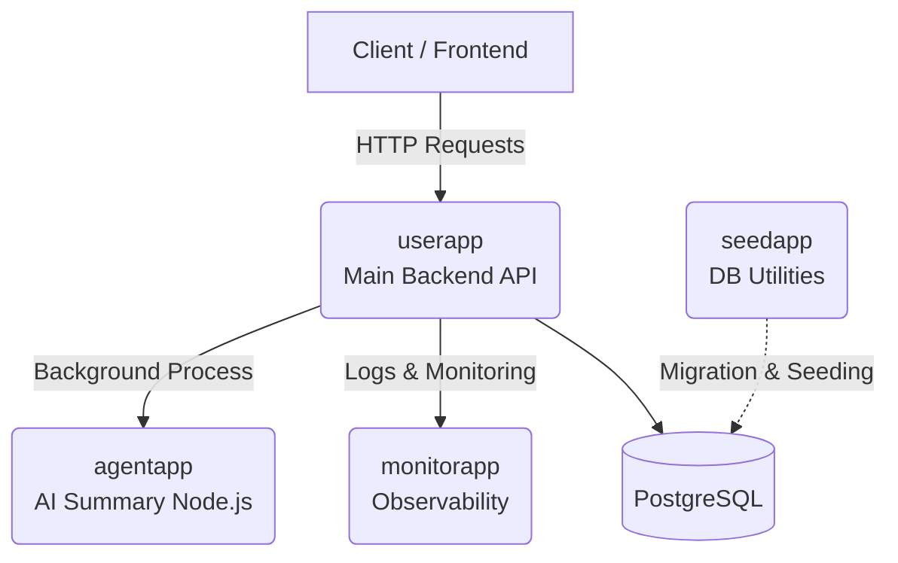

# GoNotes (Pocket App)

## 1. Nama Project dan Tech Stack

**Nama Project:** GoNotes (Pocket App) - AI-Powered Backend Delivery Workflow  
**Tech Stack:**

- **Bahasa Pemrograman:** Go (Golang)
- **Database:** PostgreSQL
- **Query Builder:** Squirrel
- **AI & Summarization:** LangGraph (via endpoint API) & Node.js (untuk background task URL summarization di `agentapp`)
- **Utility:** Go-based cross-platform scripts (menggantikan shell commands)

### Arsitektur Microservices

Sistem ini dibangun menggunakan pendekatan microservices dengan diagram dan fungsi sebagai berikut:



1. **`userapp` (Main App)**: Aplikasi utama (backend API) yang langsung berinteraksi dengan pengguna/frontend. Menangani autentikasi, manajemen pocket items, dan dashboard summary.
2. **`agentapp`**: Service berbasis Node.js yang bertanggung jawab untuk menghasilkan AI summary dari URL yang diberikan pengguna, serta menangani background processing dan task asinkron lainnya.
3. **`monitorapp`**: Service yang menangani pencatatan log aktivitas pengguna (user activity log), serta observabilitas seperti agregasi metrik dan monitoring kesehatan sistem.
4. **`seedapp`**: Service utilitas yang bertugas khusus untuk menjalankan database migration (schema update) dan seeding data awal, baik untuk main database maupun tenant database.

## 2. Cara Menjalankan Project

Proyek ini memiliki dependensi sistem pada **PostgreSQL** (sebagai database utama) dan **Redis** (harus ada, misalnya untuk caching/background task queue). Pastikan kedua infrastruktur tersebut sudah berjalan sebelum mengeksekusi aplikasi.

Proyek ini terdiri dari beberapa service mandiri. Untuk menjalankan service utama (`userapp`):

1. Pastikan PostgreSQL dan Redis sudah aktif (lihat bagian 4).
2. Masuk ke direktori service yang dituju, misal `cd userapp`.
3. Jalankan perintah `make run` untuk mengeksekusi service menggunakan Makefile.
   _(Alternatif manual: `go run main.go service`)_

## 3. Environment Variable yang Dibutuhkan

Setiap service memiliki file `.env.example` yang perlu disalin menjadi `.env`.
Contoh variabel yang dibutuhkan (seperti pada `userapp/.env.example`):

```env
DATABASE_NAME=db
DATABASE_PORT=5432
DATABASE_USER=root
DATABASE_PASSWORD=posroottgres

REDIS_PASSWORD=secret
```

## 4. Cara Menjalankan Database, Migration, dan Seed

- **Database:** Anda bisa menjalankan PostgreSQL melalui _Docker Compose_ menggunakan file `docker-compose.yml` yang tersedia di direktori `userapp` atau `seedapp`.
- **Migration & Seed:** Masuk ke direktori `seedapp` dan jalankan service-nya.
  ```bash
  cd seedapp
  make run
  ```
  Ini akan mengeksekusi migrasi dan seed yang diperlukan untuk aplikasi (termasuk pembuatan tabel dan ENUM type).

## 5. Cara Menjalankan Test

Masuk ke direktori service (contoh: `userapp` atau `seedapp`) dan gunakan Makefile:

- Untuk menjalankan test standar: `make test`
- Untuk mengecek coverage (dengan minimum target 15%): `make coverage`
- Untuk melihat coverage dalam format HTML: `make coverage-web`

_Catatan: Sistem pengecekan coverage ditulis menggunakan script Go murni (`scripts/coverage.go`) agar 100% kompatibel dengan environment Windows._

## 6. Daftar Endpoint Utama

- **Auth:**
  - `POST /api/auth/register` (Register User via API Key)
  - `POST /api/auth/login` (Login User via API Key)
- **Pockets:**
  - `POST /api/pockets` (Create Pocket Item)
  - `GET /api/pockets` (List Pocket Items dengan Search & Pagination)
  - `GET /api/pockets/summary` (Get Dashboard Summary)
  - `GET /api/pockets/:id` (Get Pocket Detail)
  - `PUT /api/pockets/:id` (Update Pocket Item)
  - `DELETE /api/pockets/:id` (Archive / Soft-Delete Pocket Item)
  - `PATCH /api/pockets/:id/status` (Update Status Baca)
  - `PATCH /api/pockets/:id/favorite` (Toggle Favorite)
  - `POST /api/pockets/:id/summarize` (Generate AI Summary)

## 7. Link ke Dokumen Penting

- [Analisis PRD](docs/01-prd-analysis.md)
- [Rencana Teknis (Technical Plan)](docs/02-technical-plan.md)
- [Desain Database](docs/03-database-design.md)
- [Kontrak Payload](docs/04-payload-contract.md)
- [Laporan Testing](docs/06-testing-report.md)
- [Laporan Pengerjaan Akhir (Delivery Report)](docs/07-delivery-report.md)

## 8. Link Recording Proses Pengerjaan

- **Demo Eksekusi:** https://youtu.be/teNi3wBIu3s

## 9. Tools AI yang Digunakan

- **Antigravity (Gemini 3.1 Pro):** Digunakan secara proaktif untuk code generation berbasis arsitektur migrasi database, refactoring shared domain model (DRY code), dan memastikan standarisasi payload contract.

## 10. Asumsi Utama dan Known Issue

- **Asumsi Utama:**
  1. Metodologi pengujian yang digunakan saat ini cukup berfokus pada **Unit Test** standar dari Go dan pengujian API manual menggunakan **Bruno**, mengingat pendekatan ini sudah memadai untuk memvalidasi fitur-fitur MVP.
- **Known Issues:**
  1. Perintah `make coverage` dapat menghasilkan **Expected Error** saat ini. Status kegagalan `exit status 1` bukan karena _syntax error_, tetapi karena perlindungan validasi (contoh: _Coverage 10.7% is below minimum required 15.0%_). Target menaikkan coverage adalah prioritas _next milestone_.
