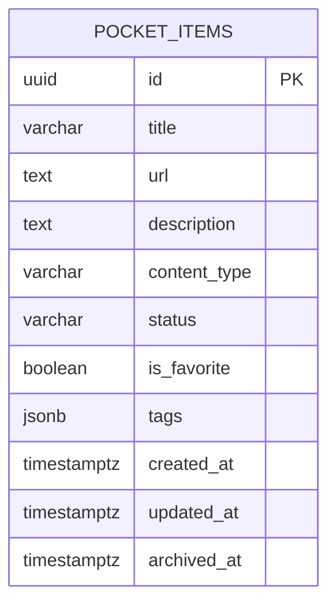

# Soal 3 - Database Design

## 1. Tujuan Database Design

Dokumen ini mendefinisikan rancangan database Pocket App berdasarkan PRD analysis dan technical plan. Desain ini menjadi acuan implementasi repository/data access layer, migration, seed data, query search/filter/sort, dashboard summary, dan strategi archive/soft delete.

Target desain:

- Mendukung aplikasi personal dalam arsitektur multi-tenant database-per-tenant/user.
- Mendukung CRUD pocket item.
- Mendukung search, filter, sort, pagination, favorite, reading status, dan archive.
- Menjamin item user lain tidak ikut terbaca melalui isolasi database tenant.
- Menyediakan constraint dan index yang cukup untuk MVP.
- Tetap sederhana agar mudah diimplementasikan dengan Go, PostgreSQL, sqlx/pgx, dan Squirrel.

## 2. Database Engine

Database yang digunakan adalah PostgreSQL.

Alasan:

- Cocok untuk data pocket item per tenant database.
- Mendukung `UUID`, `TIMESTAMPTZ`, `BOOLEAN`, `CHECK CONSTRAINT`, dan `JSONB`.
- Mendukung index yang dibutuhkan untuk filter/sort.
- Mendukung search MVP dengan `ILIKE`, dan bisa dikembangkan ke full-text search.
- Selaras dengan tech stack backend di repo.

## 3. Entity Utama

### 3.1 Tenant/User Context

Tenant/user context adalah identitas login yang menentukan database mana yang boleh diakses.

Sumber kebutuhan:

- PRD menyebut user harus login.
- User hanya dapat melihat pocket item miliknya sendiri.
- Sistem akan memakai multi-tenant database, sehingga satu user hanya diarahkan ke satu database tenant.
- Ownership tidak disimpan sebagai `user_id` di tabel pocket item, tetapi ditegakkan oleh connection routing ke tenant database yang benar.

### 3.2 Pocket Item

Pocket item adalah entitas utama aplikasi.

Pocket item menyimpan:

- Title.
- URL.
- Description.
- Content type.
- Reading status.
- Favorite marker.
- Tags.
- Timestamp create/update/archive.

### 3.3 Tag

Tag adalah master data per tenant database yang digunakan sebagai sumber dropdown saat user memberi tag pada pocket item.

Tag menyimpan:

- Name.
- Slug unik.
- Status aktif/nonaktif.
- Timestamp create/update.

### 3.4 Dashboard Summary

Dashboard summary bukan tabel fisik pada MVP. Summary dihitung dari tabel `pocket_items`.

Alasan:

- Data summary bisa dihitung dengan query agregasi.
- Menghindari data duplikat.
- Skala MVP tidak membutuhkan materialized view/cache.

### 3.5 Auth Session

Untuk MVP, session/token tidak wajib disimpan di database jika memakai JWT stateless. Jika production membutuhkan revoke token/session tracking, tabel session bisa ditambahkan sebagai future enhancement.

## 4. Relasi Antar Data

Relasi utama pada model multi-tenant database-per-tenant:

```text
auth/main database
  users/tenants -> menentukan tenant database

tenant database
  pocket_items
  tags
  pocket_item_tags
```

Makna:

- Data user/tenant berada di auth/main database.
- Data pocket item berada di tenant database.
- Satu user hanya boleh mendapatkan koneksi ke satu tenant database.
- Query pocket item di tenant database tidak perlu membawa `user_id`.
- Isolasi data terjadi sebelum repository berjalan, yaitu saat backend memilih database connection berdasarkan token/session user.

ERD sederhana:



## 5. Table Design

### 5.1 Auth/Main Database: Table `users` dan Tenant Mapping

Tabel `users` tidak berada di tenant database Pocket, melainkan di auth/main database. Tabel ini dipakai untuk login dan mapping user ke tenant database.

| Field | Type | Null | Default | Constraint | Keterangan |
| --- | --- | --- | --- | --- | --- |
| `id` | `UUID` | No | generated by app/db | PK | Identifier user |
| `name` | `VARCHAR(255)` | No | - | - | Nama user |
| `email` | `VARCHAR(255)` | No | - | unique | Email login |
| `password_hash` | `TEXT` | Yes/No | - | - | Optional untuk mock auth, required untuk real auth |
| `tenant_code` | `VARCHAR(100)` | No | - | unique atau indexed | Kode tenant/database yang boleh diakses user |
| `created_at` | `TIMESTAMPTZ` | No | `NOW()` | - | Waktu dibuat |
| `updated_at` | `TIMESTAMPTZ` | No | `NOW()` | - | Waktu terakhir diubah |

DDL referensi auth/main database:

```sql
CREATE TABLE IF NOT EXISTS users (
  id UUID PRIMARY KEY,
  name VARCHAR(255) NOT NULL,
  email VARCHAR(255) NOT NULL UNIQUE,
  password_hash TEXT NULL,
  tenant_code VARCHAR(100) NOT NULL,
  created_at TIMESTAMPTZ NOT NULL DEFAULT NOW(),
  updated_at TIMESTAMPTZ NOT NULL DEFAULT NOW()
);
```

Catatan:

- Jika repo sudah memiliki tabel `users`/`tenants` existing, cukup pastikan user login dapat dipetakan ke satu tenant database.
- Untuk mock auth, user seeded dapat menggunakan email `user@example.com`.
- Repository Pocket tidak membaca tabel `users`; repository hanya berjalan setelah connection tenant database dipilih.

### 5.2 Tenant Database: Table `pocket_items`

Table utama untuk menyimpan semua item aktif dan archived di masing-masing tenant database.

| Field | Type | Null | Default | Constraint | Keterangan |
| --- | --- | --- | --- | --- | --- |
| `id` | `UUID` | No | generated by app/db | PK | Identifier pocket item |
| `title` | `VARCHAR(255)` | No | - | non-empty via service | Judul item |
| `url` | `TEXT` | Yes | `NULL` | required by service for non-note | URL asli item |
| `description` | `TEXT` | Yes | `NULL` | - | Deskripsi opsional |
| `content_type` | `VARCHAR(32)` | No | - | check enum | article/video/document/note |
| `status` | `VARCHAR(32)` | No | `'unread'` | check enum | unread/reading/read/archived |
| `is_favorite` | `BOOLEAN` | No | `FALSE` | - | Favorite marker |
| `tags` | `JSONB` | No | `'[]'::jsonb` | - | Array string untuk tag (e.g. `["frontend", "react"]`) |
| `created_at` | `TIMESTAMPTZ` | No | `NOW()` | - | Waktu item dibuat |
| `updated_at` | `TIMESTAMPTZ` | No | `NOW()` | - | Waktu item terakhir diubah |
| `archived_at` | `TIMESTAMPTZ` | Yes | `NULL` | - | Waktu item diarsipkan |

DDL utama:

```sql
CREATE TABLE pocket_items (
  id UUID PRIMARY KEY,
  title VARCHAR(255) NOT NULL,
  url TEXT NULL,
  description TEXT NULL,
  content_type VARCHAR(32) NOT NULL,
  status VARCHAR(32) NOT NULL DEFAULT 'unread',
  is_favorite BOOLEAN NOT NULL DEFAULT FALSE,
  tags JSONB NOT NULL DEFAULT '[]'::jsonb,
  created_at TIMESTAMPTZ NOT NULL DEFAULT NOW(),
  updated_at TIMESTAMPTZ NOT NULL DEFAULT NOW(),
  archived_at TIMESTAMPTZ NULL
);
```

Catatan:

- Kolom `tags` menyimpan data tag langsung dalam bentuk JSONB array of strings.
- Validasi duplikasi tag dalam satu item dilakukan di level service/aplikasi sebelum data disimpan ke database.

## 6. Enum dan Constraint

### 6.1 Content Type

Nilai valid:

- `article`
- `video`
- `document`
- `note`

Constraint:

```sql
ALTER TABLE pocket_items
  ADD CONSTRAINT pocket_items_content_type_check
  CHECK (content_type IN ('article', 'video', 'document', 'note'));
```

### 6.2 Status

Nilai valid:

- `unread`
- `reading`
- `read`
- `archived`

Constraint:

```sql
ALTER TABLE pocket_items
  ADD CONSTRAINT pocket_items_status_check
  CHECK (status IN ('unread', 'reading', 'read', 'archived'));
```

### 6.3 Tag Rule

Rule tag:

- Tag disimpan sebagai JSONB array of strings pada kolom `tags` di tabel `pocket_items`.
- Pocket item tidak boleh memiliki tag duplicate di dalam array-nya (misal: `["react", "react"]` tidak diperbolehkan). Validasi ini dilakukan di service layer.
- List dropdown tag untuk UI dapat diekstrak secara dinamis dari database menggunakan query `jsonb_array_elements_text` secara unik, atau dikelola di level aplikasi.

### 6.4 URL Rule

Rule PRD:

- URL wajib untuk `article`, `video`, dan `document`.
- URL tidak wajib untuk `note`.
- URL harus format valid.

Rekomendasi:

- Validasi utama dilakukan di service layer.
- Database dapat menambahkan constraint ringan agar data tetap aman.

Constraint opsional:

```sql
ALTER TABLE pocket_items
  ADD CONSTRAINT pocket_items_url_required_check
  CHECK (
    content_type = 'note'
    OR (url IS NOT NULL AND length(trim(url)) > 0)
  );
```

Validasi format URL tetap dilakukan di service layer karena regex URL di database biasanya sulit dirawat.

## 7. Index Design

### 7.1 Index untuk List Default

Query paling sering:

```sql
SELECT *
FROM pocket_items
WHERE archived_at IS NULL
ORDER BY created_at DESC
LIMIT $1 OFFSET $2;
```

Index:

```sql
CREATE INDEX idx_pocket_items_active_created_at
  ON pocket_items(created_at DESC)
  WHERE archived_at IS NULL;
```

Alasan:

- Mempercepat list utama.
- Partial index lebih kecil karena hanya item aktif.

### 7.2 Index untuk Archive Page

Query:

```sql
SELECT *
FROM pocket_items
WHERE archived_at IS NOT NULL
ORDER BY archived_at DESC;
```

Index:

```sql
CREATE INDEX idx_pocket_items_archived_at
  ON pocket_items(archived_at DESC)
  WHERE archived_at IS NOT NULL;
```

### 7.3 Index untuk Filter Status

Query:

```sql
WHERE archived_at IS NULL
  AND status = $1
```

Index:

```sql
CREATE INDEX idx_pocket_items_status_active
  ON pocket_items(status, created_at DESC)
  WHERE archived_at IS NULL;
```

### 7.4 Index untuk Filter Content Type

```sql
CREATE INDEX idx_pocket_items_content_type_active
  ON pocket_items(content_type, created_at DESC)
  WHERE archived_at IS NULL;
```

### 7.5 Index untuk Filter Favorite

```sql
CREATE INDEX idx_pocket_items_favorite_active
  ON pocket_items(is_favorite, created_at DESC)
  WHERE archived_at IS NULL;
```

### 7.6 Index untuk Sort Title

Jika sort title cukup sering:

```sql
CREATE INDEX idx_pocket_items_title_active
  ON pocket_items(lower(title))
  WHERE archived_at IS NULL;
```

### 7.7 Index untuk Tags

Index GIN untuk pencarian dan filter tag dalam JSONB array:

```sql
CREATE INDEX idx_pocket_items_tags
  ON pocket_items USING gin(tags);
```

Catatan:

- Index GIN (`USING gin(tags)`) mempercepat operasi pencarian tag menggunakan operator JSONB seperti `@>` atau pencarian elemen array.

### 7.8 Search Index Future Enhancement

Untuk full-text search:

```sql
CREATE INDEX idx_pocket_items_search_vector
  ON pocket_items USING GIN (
    to_tsvector(
      'simple',
      coalesce(title, '') || ' ' ||
      coalesce(url, '') || ' ' ||
      coalesce(description, '')
    )
  );
```

MVP belum wajib memakai full-text search karena PRD hanya membutuhkan search responsif untuk data mock/minimal.

## 8. Soft Delete dan Archive Strategy

PRD menyatakan delete pada MVP diperlakukan sebagai archive/soft delete.

Strategi:

- Tidak ada hard delete untuk action delete user.
- Saat user archive/delete item:
  - Set `status = 'archived'`.
  - Set `archived_at = NOW()`.
  - Set `updated_at = NOW()`.
- List utama hanya mengambil item dengan `archived_at IS NULL`.
- Archive page mengambil item dengan `archived_at IS NOT NULL`.

SQL archive:

```sql
UPDATE pocket_items
SET
  status = 'archived',
  archived_at = NOW(),
  updated_at = NOW()
WHERE id = $1
  AND archived_at IS NULL;
```

Jika restore ditambahkan di masa depan:

```sql
UPDATE pocket_items
SET
  status = 'unread',
  archived_at = NULL,
  updated_at = NOW()
WHERE id = $1
  AND archived_at IS NOT NULL;
```

Keputusan source of truth:

- `archived_at` menjadi source of truth untuk item aktif/archived.
- `status = 'archived'` dipertahankan agar selaras dengan PRD dan mudah ditampilkan.

## 9. Query Pattern Repository

### 9.1 List Active Pocket Items

```sql
SELECT
  id,
  title,
  url,
  description,
  content_type,
  status,
  is_favorite,
  created_at,
  updated_at,
  archived_at
FROM pocket_items
WHERE archived_at IS NULL
ORDER BY created_at DESC
LIMIT $1 OFFSET $2;
```

### 9.2 Search

```sql
WHERE archived_at IS NULL
  AND (
    title ILIKE $1
    OR url ILIKE $1
    OR description ILIKE $1
    OR EXISTS (
      SELECT 1
      FROM jsonb_array_elements_text(tags) AS tag
      WHERE tag ILIKE $1
    )
  )
```

Parameter search:

```text
%react%
```

### 9.3 Filter Kombinasi

```sql
WHERE archived_at IS NULL
  AND status = $1
  AND content_type = $2
  AND is_favorite = $3
```

Condition status/content type/favorite hanya ditambahkan jika query parameter tersedia.

### 9.4 Detail By ID

```sql
SELECT *
FROM pocket_items
WHERE id = $1;
```

Catatan:

- Jika tidak ditemukan, return not found.
- Query tidak memakai `user_id` karena repository sudah berjalan pada tenant database milik user aktif.
- Akses lintas user dicegah oleh tenant connection routing sebelum query dijalankan.

### 9.5 Dashboard Summary

```sql
SELECT
  COUNT(*) FILTER (WHERE archived_at IS NULL) AS total_items,
  COUNT(*) FILTER (WHERE archived_at IS NULL AND status = 'unread') AS total_unread,
  COUNT(*) FILTER (WHERE archived_at IS NULL AND status = 'reading') AS total_reading,
  COUNT(*) FILTER (WHERE archived_at IS NULL AND status = 'read') AS total_read,
  COUNT(*) FILTER (WHERE archived_at IS NULL AND is_favorite = TRUE) AS total_favorite
FROM pocket_items
```

Recent items:

```sql
SELECT *
FROM pocket_items
WHERE archived_at IS NULL
ORDER BY created_at DESC
LIMIT 5;
```

## 10. Migration Plan

### 10.1 Migration File

Nama file yang disarankan:

```text
202606300900_create_pocket_items
```

Jika mengikuti struktur Go migration di repo, file dapat berupa:

```text
seedapp/scripts/migrations/main/202606300900_create_pocket_items.go
```

Atau jika migration berada di `userapp`:

```text
userapp/scripts/migrations/202606300900_create_pocket_items.go
```

### 10.2 Up Migration

```sql
CREATE TABLE pocket_items (
  id UUID PRIMARY KEY,
  title VARCHAR(255) NOT NULL,
  url TEXT NULL,
  description TEXT NULL,
  content_type VARCHAR(32) NOT NULL,
  status VARCHAR(32) NOT NULL DEFAULT 'unread',
  is_favorite BOOLEAN NOT NULL DEFAULT FALSE,
  tags JSONB NOT NULL DEFAULT '[]'::jsonb,
  created_at TIMESTAMPTZ NOT NULL DEFAULT NOW(),
  updated_at TIMESTAMPTZ NOT NULL DEFAULT NOW(),
  archived_at TIMESTAMPTZ NULL,

  CONSTRAINT pocket_items_content_type_check
    CHECK (content_type IN ('article', 'video', 'document', 'note')),
  CONSTRAINT pocket_items_status_check
    CHECK (status IN ('unread', 'reading', 'read', 'archived')),
  CONSTRAINT pocket_items_url_required_check
    CHECK (
      content_type = 'note'
      OR (url IS NOT NULL AND length(trim(url)) > 0)
    )
);

CREATE INDEX idx_pocket_items_active_created_at
  ON pocket_items(created_at DESC)
  WHERE archived_at IS NULL;

CREATE INDEX idx_pocket_items_archived_at
  ON pocket_items(archived_at DESC)
  WHERE archived_at IS NOT NULL;

CREATE INDEX idx_pocket_items_status_active
  ON pocket_items(status, created_at DESC)
  WHERE archived_at IS NULL;

CREATE INDEX idx_pocket_items_content_type_active
  ON pocket_items(content_type, created_at DESC)
  WHERE archived_at IS NULL;

CREATE INDEX idx_pocket_items_favorite_active
  ON pocket_items(is_favorite, created_at DESC)
  WHERE archived_at IS NULL;

CREATE INDEX idx_pocket_items_title_active
  ON pocket_items(lower(title))
  WHERE archived_at IS NULL;

CREATE INDEX idx_pocket_items_tags
  ON pocket_items USING gin(tags);
```
```

### 10.3 Down Migration

```sql
DROP TABLE IF EXISTS pocket_items;
```
```

Karena index dan constraint dibuat di dalam/terkait table, `DROP TABLE` akan menghapus semuanya.

## 11. Seed Data Plan

Seed data diperlukan untuk:

- Login mock user.
- Testing dashboard summary.
- Testing list/detail/search/filter/sort/favorite/status/archive.
- Membantu frontend development tanpa membuat data manual.

### 11.1 Seed User/Tenant Mapping

```sql
INSERT INTO users (
  id,
  name,
  email,
  password_hash,
  tenant_code,
  created_at,
  updated_at
) VALUES (
  '00000000-0000-0000-0000-000000000001',
  'Pocket Demo User',
  'user@example.com',
  NULL,
  'pocket_demo_tenant',
  NOW(),
  NOW()
)
ON CONFLICT (email) DO NOTHING;
```

Catatan:

- Untuk mock auth, password dapat dikelola di config.
- Jika real auth digunakan, `password_hash` harus diisi hasil hash.
- Seed user berada di auth/main database, bukan tenant database.

### 11.2 Seed Pocket Items

Seed pocket item dijalankan di tenant database `pocket_demo_tenant`.

```sql
INSERT INTO pocket_items (
  id,
  title,
  url,
  description,
  content_type,
  status,
  is_favorite,
  tags,
  created_at,
  updated_at,
  archived_at
) VALUES
(
  '10000000-0000-0000-0000-000000000001',
  'React Performance Guide',
  'https://example.com/react-performance',
  'A guide about React rendering optimization',
  'article',
  'unread',
  TRUE,
  '["frontend", "react"]'::jsonb,
  '2026-06-26T10:00:00Z',
  '2026-06-26T10:00:00Z',
  NULL
),
(
  '10000000-0000-0000-0000-000000000002',
  'Understanding TypeScript Generics',
  'https://example.com/typescript-generics',
  'Deep dive into TypeScript generics',
  'article',
  'reading',
  FALSE,
  '["typescript", "frontend"]'::jsonb,
  '2026-06-25T09:30:00Z',
  '2026-06-25T09:30:00Z',
  NULL
),
(
  '10000000-0000-0000-0000-000000000003',
  'Frontend System Design Notes',
  NULL,
  'Personal notes about scalable frontend architecture',
  'note',
  'read',
  TRUE,
  '["architecture", "frontend"]'::jsonb,
  '2026-06-24T08:00:00Z',
  '2026-06-24T08:00:00Z',
  NULL
),
(
  '10000000-0000-0000-0000-000000000004',
  'Archived Design Reference',
  'https://example.com/design-reference',
  'Old design reference kept for archive testing',
  'document',
  'archived',
  FALSE,
  '["design", "reference"]'::jsonb,
  '2026-06-20T08:00:00Z',
  '2026-06-28T08:00:00Z',
  '2026-06-28T08:00:00Z'
)
ON CONFLICT (id) DO NOTHING;
```
```

## 12. Data Access Rules

Repository wajib mengikuti aturan berikut:

- Repository Pocket wajib menerima connection tenant database yang sudah dipilih dari auth/tenant context.
- Query pocket item tidak perlu filter `user_id` karena berjalan di database tenant milik user aktif.
- List utama wajib menambahkan `archived_at IS NULL`.
- Archive list wajib menambahkan `archived_at IS NOT NULL`.
- Detail/update/archive cukup memakai `id` di dalam tenant database aktif.
- Mutation harus mengubah `updated_at`.
- Archive tidak boleh melakukan hard delete.
- Create harus menghasilkan `id`, `created_at`, dan `updated_at`.
- Response mutation sebaiknya mengembalikan row terbaru.

## 13. Validasi yang Dilakukan di Database vs Service

| Rule | Database | Service |
| --- | --- | --- |
| `id` unik | Primary key | Generate UUID |
| Tenant isolation | Database terpisah per tenant | Pilih connection dari auth/tenant context |
| `title` wajib | `NOT NULL` | Trim dan tidak boleh kosong |
| `content_type` valid | Check constraint | Enum validation |
| `status` valid | Check constraint | Enum validation dan transition rule |
| `url` wajib untuk non-note | Optional check constraint | Business validation utama |
| `url` format valid | Tidak | URL parser dan allowed scheme |
| Format tags valid | Kolom `tags` NOT NULL DEFAULT '[]'::jsonb | Validasi struktur JSON array string di service |
| `is_favorite` default false | Default | Set default saat create |
| `status` default unread | Default | Set default saat create |
| Soft delete | `archived_at` nullable | Archive use case |

## 14. Pertimbangan Alternatif

### 14.1 Tags sebagai Master Data dan Table Relasi

Alternatif:

Menggunakan tabel `tags` dan tabel relasi `pocket_item_tags` (Many-to-Many).

Kelebihan:

- Mendukung dropdown dari master data terpusat.
- Lebih normalized dan konsisten.
- Mencegah duplicate tag per item dengan composite primary key.
- Cocok untuk tag autocomplete, tag analytics, active/inactive tag, dan dedup global.

Kekurangan:

- Perlu join saat membaca tag item.
- Perlu transaction saat create/update pocket item beserta relasi tag.

Keputusan MVP:

- Tidak digunakan, karena tim sepakat menggunakan penyimpanan tag langsung dalam kolom `tags` (JSONB) pada tabel `pocket_items` untuk mempermudah query dan mempercepat implementasi awal.

### 14.2 Tags sebagai `JSONB` di `pocket_items`

Desain yang dipilih:

```sql
tags JSONB NOT NULL DEFAULT '[]'::jsonb
```

Kelebihan:

- Lebih sederhana jika tag selalu string.
- Query array PostgreSQL cukup kuat.
- Tidak perlu join untuk membaca list tag.
- Proses insert/update sangat cepat dan tidak membutuhkan multi-table transactions.

Kekurangan:

- Tidak ada master data terpusat untuk dropdown (dropdown di-generate dinamis dari data yang ada atau dari config).
- Sulit mengontrol tag aktif/nonaktif.
- Sulit menjaga konsistensi penamaan tag antar item di level database.

Keputusan MVP:

- Gunakan kolom `tags` bertipe `JSONB` pada tabel `pocket_items`.

### 14.3 Hard Delete

Alternatif:

```sql
DELETE FROM pocket_items WHERE id = $1;
```

Keputusan MVP:

- Tidak digunakan, karena PRD menyatakan delete diperlakukan sebagai archive/soft delete.

## 15. Future Database Enhancement

Jika aplikasi berkembang dari MVP:

- Tambahkan table `auth_sessions` untuk session revoke/refresh token.
- Tambahkan audit field `created_by`/`updated_by` jika satu tenant database nanti bisa diakses banyak user.
- Tambahkan warna/icon/urutan tag jika dropdown membutuhkan metadata visual.
- Tambahkan full-text search vector dan GIN index.
- Tambahkan duplicate URL detection per tenant database.
- Tambahkan restore archive endpoint dan audit log.
- Tambahkan `deleted_at` jika perlu membedakan archive dan recycle-bin delete.
- Tambahkan materialized dashboard summary jika data sangat besar.
- Tambahkan `metadata` JSONB untuk auto metadata extraction dari URL.

## 16. Kesimpulan

Database design Pocket App memakai pemisahan auth/main database dan tenant database. Auth/main database menyimpan user serta mapping tenant, sedangkan tenant database menyimpan `pocket_items` tanpa `user_id`.

Tabel `pocket_items` dirancang untuk mendukung create, list, detail, update, archive, search, filter, sort, favorite, reading status, dashboard summary, dan pagination. Soft delete dilakukan dengan `archived_at` serta `status='archived'`, sementara tag disimpan langsung di dalam tabel `pocket_items` sebagai JSONB array of strings agar implementasi lebih sederhana.

Dengan constraint, index, migration, dan seed data di dokumen ini, repository/data access layer dapat diimplementasikan langsung. Keamanan akses lintas user dijaga oleh tenant connection routing sebelum query masuk ke repository.
